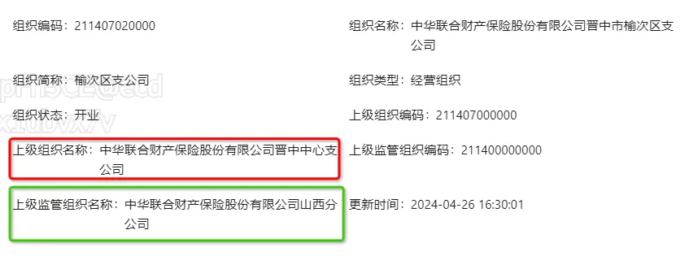

[组织员工主数据业务场景案例](https://cic_irc.yuque.com/tyl581/ggwv9w/kqq2zumnm4w057wy "组织员工主数据业务场景案例")

https://cic_irc.yuque.com/tyl581/ggwv9w/gw9dozki28mc54by
## 组织：OrgInfoDTO

|   |   |   |
|---|---|---|
|**字段名称**|**字段类型**|**字段描述**|
|branchOrgCode|String|组织编码|
|branchOrgType|String|**组织类型**：码值：organization_type_cd  💥：**0「经营组织」、1「管理组织」、2「销售组织」**|
|orgBasicDetailDTO|OrgBasicDetailDTO|组织基础信息对象：{三种类型组织**共有属性**字段}|
|orgOperationDetailDTO|OrgOperationDetailDTO|经营组织对象：{经营组织类型**特有属性**字段}⚠️区分组织类型  🚩管理组织、销售组织该值为空|
|orgManageDetailDTO|OrgManageDetailDTO|管理组织对象：{管理组织类型**特有属性**字段}⚠️区分组织类型  🚩经营组织、销售组织该值为空|
|orgSaleDetaiDTO|OrgSaleDetaiDTO|销售组织对象：{销售组织类型**特有属性**字段}⚠️区分组织类型  🚩经营组织、管理组织该值为空|

### 组织基本信息-OrgBasicDetailDTO

|   |   |   |
|---|---|---|
|**字段名称**|**字段类型**|**字段描述**|
|branchOrgCode|String|组织编码|
|branchOrgName|String|组织名称「组织的全称」|
|branchOrgSimpleName|String|组织简称|
|branchOrgStatus|Integer|组织状态：码值：organization_status_cd  💥：0「筹建」、1「开业」、2「撤销」|
|branchOrgType|String|组织类型：码值：organization_type_cd  💥：0「经营组织」、1「管理组织」、2「销售组织」|
|branchOrgManageParentCode|String|上级组织编码（行政管理维度）|
|branchOrgManagePath|String|行政管理维度的组织path路径|
|branchOrgSuperviseParentCode|String|上级监管组织编码（监管维度）|
|branchOrgSupervisePath|String|监管维度的组织path路径|

### 经营组织-OrgOperationDetailDTO

|   |   |   |
|---|---|---|
|**字段名称**|**字段类型**|**字段描述**|
|branchOrgCode|String|组织编码|
|branchOrgName|String|组织名称「组织的全称」|
|establishDate|String|经营组织成立日期（分支机构成立日期）|
|unifiedSocialCreditNumber|String|统一社会信用代码|
|superviseArea|String|监管辖区|
|address|String|组织地址|
|branchOrgState|String|经营组织状态：码值：branch_org_status_cd  💥：01「存续」、02「在业」、03「吊销」、04「注销」、05「迁入」、06「迁出」、07「停业」、08「清算」、09「接管」、99「其他」|
|operationScope|String|经营范围|
|branchOrgLevel|String|经营组织级别：码值：branch_org_level_cd  💥：0「一级机构」、1「二级机构」、2「三级机构」、3「四级机构」、4「五级机构」|
|branchOrgCategory|String|经营组织设立类别：码值：branch_org_category_cd  💥：0「内设」、1「外设」|
|branchOrgHierarchy|String|经营组织层级：码值：branch_org_hierarchy_cd  💥：0「总公司」、1「分公司」、2「中心支公司」、3「支公司」、4「营业部」、5「营销服务部」、6「内设业务机构」、7「电话销售专属机构」、8「其他专属机构」|
|isFranchise|String|是否专营机构：码值：franchise_organization_cd  💥：0「否」、1「是」|
|franchiseType|String|专营类型：码值：franchise_type_cd  💥：0「非专营机构」、1「综合经营机构」、2「集约型机构」、3「政保」、4「车商」、5「中介」、6「线上」、7「前置」、8「重客」、9「团客」|
|isSetBooks|String|是否设立独立帐套：码值：independent_acct_book_cd  💥：0「否」、1「是」|
|isSetIssue|String|是否出单组织：码值：set_issue_org_cd  💥：0「否」、1「是」|
|belongedRegionType|String|所属地域类型：码值：region_type_cd  💥：0「全国」、1「省」、2「直辖市」、3「计划单列市」、4「区域」、5「省会」、6「地市」、7「城区」、8「县域」、9「街道」、10「乡镇」|
|belongedProvinceCode|String|所属省|
|belongedCityCode|String|所属市|
|belongedDistrictCode|String|所属区县|
|responsibleEmployeeCode|String|负责人代码|
|insuranceLicenceNumber|String|保险许可证机构编码|
|licenceIssueDate|String|许可证发放日期|
|licenceCancelDate|String|许可证注销日期|
|regulatoryApprovalNumber|String|监管部门批准开业文号|
|domesticForeignFlag|String|境内外标志|

### 管理组织-OrgManageDetailDTO

|   |   |   |
|---|---|---|
|**字段名称**|**字段类型**|**字段描述**|
|branchOrgCode|String|组织编码|
|branchOrgName|String|组织名称「组织的全称」|
|branchOrgUnitTypeManage|String|管理组织单元类型：码值：manage_org_unit_type_cd  💥：1「总公司本部」、2「总公司部门」、3「总公司部门二级中心」、4「总公司处室」、5「共享服务中心本部」、6「共享服务中心部门」、7「共享服务中心二级中心」、8「分公司本部」、9「分公司部门」、10「分公司部门二级中心」、11「中心支公司本部」、12「中心支公司部门」、13「支公司部门」、14「营销服务部部门」|
|isClaimsDept|String|是否理赔部门：码值：is_claim_dept_cd 💥：0「否」、1「是」|
|isBothManageOperation|String|是否管营一体：码值：is_manage_operation_integrated_cd 💥：0「否」、1「是」|
|isSetIssue|String|是否出单组织：码值：set_issue_org_cd 💥：0「否」、1「是」|
|setupNumber|String|设立文号|

### 销售组织-OrgSaleDetaiDTO

|   |   |   |
|---|---|---|
|**字段名称**|**字段类型**|**字段描述**|
|branchOrgCode|String|组织编码|
|branchOrgName|String|组织名称「组织的全称」|
|branchOrgUnitTypeSale|String|销售组织单元类型：码值：sale_org_unit_type_cd **（画线的代表码值无效）**  💥：1「车商团队」、2「重客团队(新类型)」、3「团客团队(新类型)」、4「政保农险团队(新类型)」、5「创享团队(新类型)」、6「电融团队(新类型)」、7「直拓团车团队(新类型)」、8「中介团队(新类型)」、9「直拓综合团队(新类型)」、10「综合团队」、11「代理团队」、12「经纪重客团队」、13「新渠道团队」、14「网销团队」、15「综拓团队」、16「三农团队」、17「政保健康险团队(新类型)」、18「网销团队(新类型)」|
|branchOrgOperationChannel|String|销售组织经营渠道：码值：sale_org_channel_cd **（待废弃）**  💥：1「车商渠道」、2「电销渠道」、3「互联网渠道」、4「个人直销」、5「团体直销」、6「个代渠道」、7「重客渠道」、8「政保渠道」、9「中介渠道」、10「综合渠道」、11「代理渠道」、12「经纪重客渠道」、13「新渠道」、14「网销渠道」、15「综拓渠道」、16「三农渠道」|

---

## 员工：EmployeeInfoDTO

|   |   |   |
|---|---|---|
|**字段名称**|**字段类型**|**字段描述**|
|employeeCode|String|员工工号（员工编码）|
|employeeName|String|员工名称|
|branchOrgCode|String|员工所属组织编码|
|branchOrgName|String|员工所属组织名称|
|operationOrgCode|String|员工所属经营组织编码|
|operationOrgName|String|员工所属经营组织名称|
|employeeStatus|String|员工状态：码值：personnel_status_cd|
|gender|String|性别：码值：hr_personnel_gender_cd|
|nationality|String|国籍：码值：hr_nationality_cd|
|nativePlace|String|籍贯：码值：area_cd|
|ethnic|String|民族：码值：ethnic_cd|
|birthAddress|String|出生地|
|birthDate|String|出生日期|
|registerResidenceAddress|String|户口所在地|
|politicalStatus|String|政治面貌：码值：political_outlook_cd|
|joinPartyDate|String|参加政党日期|
|maritalStatus|String|婚姻状况：码值：hr_marriage_status_cd|
|contactNumber|String|联系电话|
|certificateType|String|证件类型：码值：hr_cert_type_cd|
|certificateNumber|String|证件号码|
|education|String|学历：码值：education_cd|
|proTechQualification|String|专业技术资格：码值：abs_pro_tech_qua_cd|
|position|String|岗位（待废弃⚠️下面有新岗位体系描述）|
|joinCompanyDate|String|入司日期|
|leaveCompanyDate|String|离职日期|
|employmentType|String|用工类型：码值：employment_type_cd  💥：0「固定期限劳动合同」、1「无固定期限劳动合同」、2「劳务派遣」、3「与其他单位保留劳动合同关系的劳务人员」、4「返聘制」、5「实习生」|
|employeeWorkPositionResDTOS|List<EmployeeWorkPositionResDTO>|员工岗位信息（新岗位体系）👇|

### 员工岗位模型-EmployeeWorkPositionResDTO

|   |   |   |
|---|---|---|
|**字段名称**|**字段类型**|**字段描述**|
|workPositionId|String|工作岗位id|
|workPositionName|String|工作岗位名称|
|workPositionCode|String|工作岗位编码|
|activeStatus|String|在职状态判断是否兼职(**待废弃**-同positionType)|
|employeeActiveStatus|String|员工状态  码值：position_status_cd 工作岗位状态|
|positionType|String|员工在此工作岗位的类型  码值：position_type_cd 工作岗位类型  💥：1「主职位」2「兼职职位」3「外派职位」4「借调职位」|
|branchOrgCode|String|员工所属组织编码|
|branchOrgName|String|员工所属组织名称|
|operationOrgCode|String|员工所属经营组织编码（所属组织的上级组织中的经营组织）|
|operationOrgName|String|员工所属经营组织名称|
|standardPositionResDTO|StandardPositionResDTO|工作岗位所属标准岗位信息|
|｜standardPositionId|String|工作岗位所属标准岗位Id|
|｜standardPositionName|String|工作岗位所属标准岗位名称|
|｜standardPositionCode|String|工作岗位所属标准岗位编码|
|｜standardPostDescription|String|工作岗位所属标准岗位描述|
|｜positionSequenceResDTO|PositionSequenceResDTO|工作岗位所属标准岗位岗位序列信息|
|｜positionSequenceId|String|工作岗位所属标准岗位岗位序列Id|
|｜positionSequenceCode|String|工作岗位所属标准岗位岗位序列编码|
|｜positionSequenceName|String|工作岗位所属标准岗位岗位序列名称|
|｜positionSubSequenceResDTO|PositionSequenceResDTO|工作岗位所属标准岗位岗位子序列信息|
|｜positionSequenceId|String|工作岗位所属标准岗位岗位子序列Id|
|｜positionSequenceCode|String|工作岗位所属标准岗位岗位子序列编码|
|｜positionSequenceName|String|工作岗位所属标准岗位岗位子序列名称|
|workFunctionResDTOList|List<WorkFunctionResDTO>|工作岗位包含工作职能信息|
|｜workFunctionId|String|工作职能id|
|｜workFunctionCode|String|工作职能编码|
|｜workFunctionName|String|工作职能名称|
|｜workFunctionDesc|String|工作职能描述（备注）|

  

---

## 🚩模型字段介绍

### 上级组织

- 字段：branchOrgManageParentCode
- 定义：上级组织通常指的是在保险行业内部，对某一保险公司或保险机构具有直接领导和管理权的上级机构或组织。
- 功能：

- 负责设定政策方向、目标、任务和指标，并指导下级保险组织进行具体实施。
- 提供必要的资源支持，如资金、人力、技术等，以确保下级保险组织能够顺利完成任务。

### 上级监管组织

- 字段：branchOrgSuperviseParentCode
- 定义：上级监管组织是指负责对保险公司和整个保险行业进行监管、监督和管理的上级机构或组织。在中国，这个组织是中国保险监督管理委员会（保监会），现已更名为中国银行保险监督管理委员会（银保监会）。
- 功能：

- 制定并执行保险行业的监管政策和法规，确保保险市场的健康运行。
- 审批和控制保险公司的设立和运营，确保其满足一定的资本要求、业务能力和管理水平。
- 监督和评估保险公司的财务状况和风险管理措施，处理投诉并进行调解。
- 维护保险业的合法、稳健运行，监管保险公司偿付能力和市场行为，管理保险保障基金，监管保险保证金，防范和化解金融风险，保护金融消费者合法权益，维护金融稳定。

### 上级组织/上级监管组织区别

- **性质：**

- 上级组织：主要侧重于在保险行业内部进行领导和管理。
- 上级监管组织：作为独立的监管机构，对整个保险行业进行外部监管和监督。

- **功能：**

- 上级组织：更多地涉及政策制定、资源分配和内部管理。
- 上级监管组织：更侧重于法规制定、监督管理和风险防范。

- **关系：**

- 上级组织：与下级保险组织之间是领导与被领导的关系。
- 上级监管组织：与保险公司之间是监管与被监管的关系。

- **目标：**

- 上级组织：确保下级保险组织能够高效、有序地完成各项任务。
- 上级监管组织：确保整个保险行业的合规性、安全性和稳定性。

- **例子：榆次区支公司**

  

  

**员工噶**
