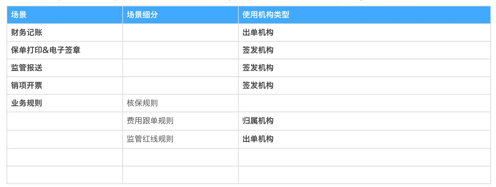

https://cic_irc.yuque.com/tyl581/ggwv9w/lotoqqfgk9ggszcw
## 一、概念定义

### 1. 中华财险组织架构转型与调整后对于组织的分类

#### 1.1. 经营组织（机构）

● 定义：经监管部门批准设⽴的持牌机构，或经总公司批复设⽴的内设业务机构

● 形态：总公司、分公司、中⼼⽀公司、⽀公司、营业部、营销服务部、电话销售专属机构，以及经总公司审批的、视同三/四级机构管理的内设业务 机构。

● 级别：⼀⾄五级。通常：⼀级为总公司，⼆级为省辖/直辖市辖以及计划单列市分公司，三级为地市级中⽀公司或分公司营业部，四级为城区/县域级 ⽀公司或中⽀公司营业部，五级为⽀公司下设营销服务部。机构的级别在Hr系统中维护，以Hr系统输出的数据为准。

● 设⽴类别：外设和内设。外设机构指经监管批复、具备保险经营许可的持牌机构；内设机构指根据公司内部业务管理及核算需要，经总公司批复设⽴ 的业务机构。

● 编号特点：21开头。

#### 1.2. 管理组织（部门）

● 定义：指经营机构下设⽴的具有管理职能的部门、处室等。特点：部门的设⽴是公司根据业务管理需要的⾃主⾏为，不需要监管批复。

● 形态：理赔部、财务部、意外健康保险部、信息技术部…

● 级别：部门在显⽰形态上没有级别。部门可以挂在任⼀级别的机构下，也可以挂在部门下。

● 管营⼀体：部门数据设“是否管营⼀体”属性，⽤以区分该部门是否承担业务经营职责。是“管营⼀体”的部门意味着其有业务销售、承保及保单管理 考核要求。

● 编号特点：22开头。

#### 1.3. 销售组织（团队）

● 定义：指公司基于展业需要、依据渠道划分和销售基本法在经营机构或管营⼀体部门下设⽴的专业销售队伍。 ● 形态：⼀组销售⼈员在特定业务活动下的内聚。如：车商业务⼀团队、经纪重客⼀团队…

● 级别：团队在显⽰形态上没有级别。团队可以挂在三级及以下的机构下，也可以挂在管营⼀体部门下。

● 编号特点：23开头。

### 2. 保单上与机构相关的⼏个属性

#### 2.1. 出单机构

即保单承保机构。是指在保险经营活动中以“保险⼈”⾝份签订保险合同并履⾏合同义务的实际执⾏机构。 注意：因业务管理、市场环境、监管要求、财务核算等种种因素的综合考量，在记录的保单数据层⾯，不要求出单机构⼀定是持牌机构。

#### 2.2. 签发机构

保险合同上载明的、具备保险经营资质的“保险⼈”。在司法环境中，能够独⽴承担民事责任；是履⾏保险合同权利与义务的主体。

#### 2.3. 业务经办人

对接客户、服务客户、促成客户完成投保⾏为的业绩归属⼈。

💥💥注意：

○ 业务经办⼈须为司内销售组织下的⼈员或项⽬中指明的落地经办⼈；

○ 业务经办⼈不⼀定是销售活动的直接执⾏者，对于中介业务、电销业务，业务经办⼈⾏使的是培训或管理职能。

#### 2.4. 电销专员

电销业务实际执⾏销售活动（呼⼊、呼出）的销售专员。

💥💥注意：

○ 因电销业务的监管特殊性，电销专员不能直接作为业务经办⼈。电销业务开展时，每位电销专员会指定映射⼀位司内销售⼈员作为业务经办⼈。

○ ⽬前智能⼀体化系统中，该字段名称为“销售管家”。

#### 2.5. 业务归属团队

在业绩考核时，保单实际归属的销售团队。

#### 2.6. 业务归属机构

在业绩考核时，保单实际归属的经营机构或部门。

#### 2.7. 业务归属项目

项⽬指公司根据业务复杂程度和客户需要，整合公司内部各⽅⾯的资源进⾏公关、拓展和维护的⼀种⼯作机制，⼀般针对中⼤型重要客户或招投标 业务，由重要客户部等部门组织发起设⽴，其他根据需要也可以成⽴相应的项⽬，但应当经过审批程序。

💥💥注意：

● 项⽬是⼀种灵活的、虚拟的组织形态，在机构主数据中并不体现，⽬前是在销管系统中配置，在出单参与⽅中展现。

● 项⽬成员不受岗位序列限制，可以是管理⼈员、技术专家，也可以是具有⼀定社会资源普通员⼯。

● 项⽬成员不受所在组织的限制，可以跨部门、跨机构。

● 项⽬设⽴应当经过审批程序，项⽬成⽴后需指定经办⼈，承保出单时通过点选“项⽬”确定业务的项⽬归属。（出单机构和归属机构的规则不变）

---

## 二、规则与用法

### 1. 出单机构

|   |   |   |   |
|---|---|---|---|
|**内容项**|   |   |**系统实现方案****（建议）**|
|可选范围|- 四、五级经营机构（含内设与外设机构） - 三、四级经营机构下的管营⼀体部门（注： 可以是经营机构下直接设⽴的管营⼀体部门， 也可以是经营机构下设部门下的管营⼀体部门）|   |建议在机构主数据上统⼀设置“是否出单组织”属性。|
|管控方式|录单员录单场景|录单员在其被授权的范围内选择|销管系统内提供录单授权功能，及授权数据服务。|
|渠道API接⼊场景|适配规则管控|渠道适配平台配置规则，API接⼊时系统基于适配规则填充。|
|中华保等客户⾃助投保场景|适配规则管控|智能⼀体化配置规则，移动端投保请求时系统基于适配规则填充|

### 2. 签发机构

|   |   |   |   |
|---|---|---|---|
|**内容项**|   |   |**系统实现方案****（建议）**|
|可选范围|经营组织下的外设机构（即：持牌机构）|   ||
|管控方式|系统⾃动设置。|   |1、投保单&保单模型中增加“签发机构”属性，由系统根据规则⾃动赋值。  2、规则如下：  ● 如果出单机构本⾝就是外设机构，则取保单上的出单机构；  ● 如果出单机构⾮外设机构（内设机构或管营⼀体部门），则取该内设机构或管营⼀体部门所对应的“上级有监管批复的 经营组织”。（注：该数据⽬前已由Hr同步⾄运营⽀撑域）|

### 3. 业务经办人

|   |   |   |   |
|---|---|---|---|
|**内容项**|   |   |**系统实现方案****（建议）**|
|可选范围|销售团队下的销售⼈员或项⽬中指定的落地业务经办|   ||
|管控方式|录单员录单场景|录单员在其被授权的  范围内选择|销管系统内提供录单授权功能，及授权数据服务。|
|业务员使⽤核⼼系统、销售⼯具进⾏展业活动场景|系统默认|当前操作⽤户即为业务经办⼈，由系统⾃动设置。|
|渠道API接⼊场景|适配规则管控|渠道适配平台配置规则，API接⼊时系统基于适配规则填充|
|中华保等客户⾃助投保场景|适配规则管控|智能⼀体化配置规则，移动端投保请求时系统基于适配规则填充|
|项⽬制业务场景|项⽬代码中制定|销售系统内针对项⽬代码做落地业务经办⼈的配置|

### 4. 电销专员（销售管家）

|   |   |   |   |
|---|---|---|---|
|**内容项**|   |   |**系统实现方案****（建议）**|
|可选范围|电销专员|||
|管控方式|智能⼀体化“呼⼊、呼出”场景|系统默认|1、智能⼀体化：当前操作⽤户即电销专员（销售管家），由系统⾃动设置。  2、承保域/保单服务域：保单模型上需增加“电销专员”属性。|

### 5. 业务归属团队

系统根据“业务经办⼈”的归属团队⾃动设置，并记录在保单上。

### 6. 业务归属机构

系统根据“业务经办⼈”的归属团队的“上级组织机构”⾃动设置，并记录在保单上。 注：团队的“上级组织机构”已由Hr同步⾄运营⽀撑域。

## 三、保单上三个机构的适用场景（各板块PD持续补充）

## 四、业务实操中对特殊场景业务的处理⽅案

### 1. 财务核算对新HR机构设⽴的诉求

- 关于省分营业部虚拟机构的设⽴

每个省分公司本部都有重客部、⼤项⽬部之类的部门。在给监管报送的数据中，是按照⾏政区划统计业务的，⽽不是按照公司内设机构。⽐如说济 南市的业务，只能报⼀份数据，不能济南中⽀和省分营业部分别报送。因此重客部的业务要跟济南中⽀汇总报送。但是省分本部的费⽤等数据⼜需要独⽴出来，不能并⼊济南地区的数据，否则会造成济南的费⽤明显⾼于⾏业⽔平，引发监管风险。同时，重客部通常会执⾏独⽴的费⽤政策，因此也不能 直接放在济南中⽀下出单。基于以上⼏点，需要给省公司的重客部、⼤项⽬部设⽴⼀个独⽴的虚拟机构，这个独⽴虚拟机构的数据在报送监管数据的时候，汇⼊济南中⽀⼀并报送，⽽省分本部的费⽤数据放在⼀个单独的机构中报送。

诉求：新HR中给每个省分公司设⽴⼀个虚拟的业务机构。

- 关于管营⼀体化部门出单

⾸先，归属机构是⽤来解决“航运中⼼”等特殊场景的，不是⽤来解决管营⼀体机构出单问题的。如果将管营⼀体机构作为归属机构，不让这些机构 出单，这些机构的核算就会出问题。数据中台现阶段只能解决保费、赔款等业务科⽬的归属问题，不能解决费⽤、准备⾦的问题。在可见的未来，财务 数据还是公司考核的依据，因此这些管营⼀体机构的还是应该落到⾃⾝，以保障财务数据核算的准确性。

诉求：管营⼀体机构需要作为出单机构出单。其配置权限的管理，建议统⼀集中管理。不要将归属机构作为解决常规问题的⼿段，正常情况下，出 单机构跟归属机构应该是⼀致的。

  

参考文件：

[📎“组织、机构、管营一体”概念与用法.pdf](https://cic_irc.yuque.com/attachments/yuque/0/2023/pdf/10357533/1692865713010-b734bd9c-0d98-4cc4-82a4-c6c0c2867a73.pdf)
