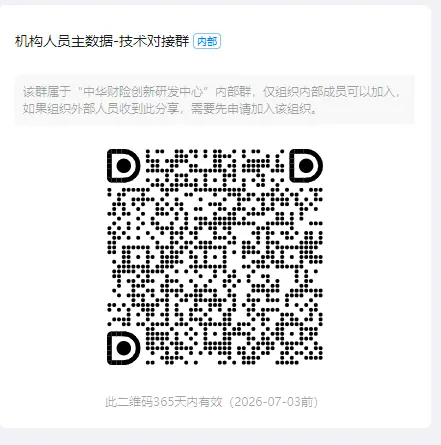

https://cic_irc.yuque.com/tyl581/ggwv9w/ii1ftzzh0z7u9g25
## SDK二方包

```
<dependency>
  <groupId>cn.cic.irc</groupId>
  <artifactId>irc-standard-config-sdk</artifactId>
  <version>1.0.0-RELEASE</version>
</dependency>
```

## 根据机构编码获取对应的映射机构编码

|   |   |
|---|---|
|包名|cn.cic.irc.organization|
|类名|OrganizationServiceImpl|
|函数名|getMappedOrgCode|

### 请求参数

|   |   |   |
|---|---|---|
|字段|类型|说明|
|branchOrgCode|String|查询映射关系的原始机构编码|

### 响应参数

说明：根据输入参数 `branchOrgCode`（查询映射关系的原始机构编码）获取到的对应映射机构编码。

根据传入的 branchOrgCode 获取对应的映射机构编码。具体规则如下：

- **正常情况**：当系统中存在与 branchOrgCode 对应的有效映射关系时，返回已配置好的映射机构编码字符串。例如，若传入的 branchOrgCode 为 "ORG_001"，且系统中配置其映射编码为 "MAPPED_ORG_001"，则返回 "MAPPED_ORG_001"。
- **未找到映射情况**：如果在系统维护的映射关系数据中，没有找到与 branchOrgCode 匹配的记录，该字段将返回和入参 branchOrgCode 相同的值，同时系统会记录一条警告日志：log.warn("No mapping found for branchOrgCode: {}", branchOrgCode);。
- **异常情况**：当在获取映射编码的过程中发生系统异常（如数据读取失败等），该字段可能返回包含错误信息的字符串（具体取决于异常处理逻辑），并且系统会记录一条错误日志：log.error("Unexpected error organization mappings, input: {}, config: {}", branchOrgCode, organizationMappings, ex);。

  

  

### 联调答疑



  

### 发布计划

计划 0717 发布上线

  

  

# ==============================

## 业务背景

因原顺德中支在监管层面撤销，原顺德中支下原有的7个营销服务部需要转移到佛山中支。新一代中具体操作为：原顺德中支及其下原有的7个营销服务部保留（新一代组织机构数据中还是开业状态），同时在佛山中支成立同样名称的7个营销服务部和顺德支公司，新老机构编码不同；新机构成立后，新业务都新机构下开展；能够迁移到新机构的数据（如中介代理、合作伙伴及相关合约）都迁移至新机构；老业务（历史保单查询、批改、理赔等）需要在老机构操作（指操作账号的权限机构范围=老机构），但是所有对外数据（包括对客保单、对监管报送数据、用章）要以新机构的名义产生；原顺德中支财务账户不能再使用，所有财务相关的费用要在新机构下收付、开票；原顺德中支停业时间为2025年5月21日，原顺德中支下原有的7个营销服务部切换时间也为2025年5月21日，即从2025年5月22日开始的新业务都在新机构开展。  

**新老机构关系：**

|   |   |   |   |   |   |   |   |
|---|---|---|---|---|---|---|---|
|**原机构名称**|**原机构编码**|**原上级机构名称**|**原上级机构编码**|**新机构名称**|**新机构编码**|**新上级机构名称**|**新上级机构编码**|
|顺德中心支公司|214499000000|广东分公司|214400000000|佛山中心支公司|214406000000|广东分公司|214400000000|
|陈村营销服务部|214499910000|顺德中心支公司|214499000000|陈村营销服务部|214406130000|佛山中心支公司|214406000000|
|龙江营销服务部|214499930000|顺德中心支公司|214499000000|龙江营销服务部|214406100000|佛山中心支公司|214406000000|
|杏坛营销服务部|214499940000|顺德中心支公司|214499000000|杏坛营销服务部|214406120000|佛山中心支公司|214406000000|
|乐从营销服务部|214499950000|顺德中心支公司|214499000000|乐从营销服务部|214406110000|佛山中心支公司|214406000000|
|第三营销服务部|214499960000|顺德中心支公司|214499000000|第三营销服务部|214406160000|佛山中心支公司|214406000000|
|第二营销服务部|214499970000|顺德中心支公司|214499000000|第二营销服务部|214406150000|佛山中心支公司|214406000000|
|第一营销服务部|214499980000|顺德中心支公司|214499000000|第一营销服务部|214406140000|佛山中心支公司|214406000000|

  

## 机构映射关系

原机构编码唯一

|   |   |
|---|---|
|**原机构编码**|**目标机构编码**|
|214499000000|214406000000|
|214499910000|214406130000|
|214499930000|214406100000|
|214499940000|214406120000|
|214499950000|214406110000|
|214499960000|214406160000|
|214499970000|214406150000|
|214499980000|214406140000|
