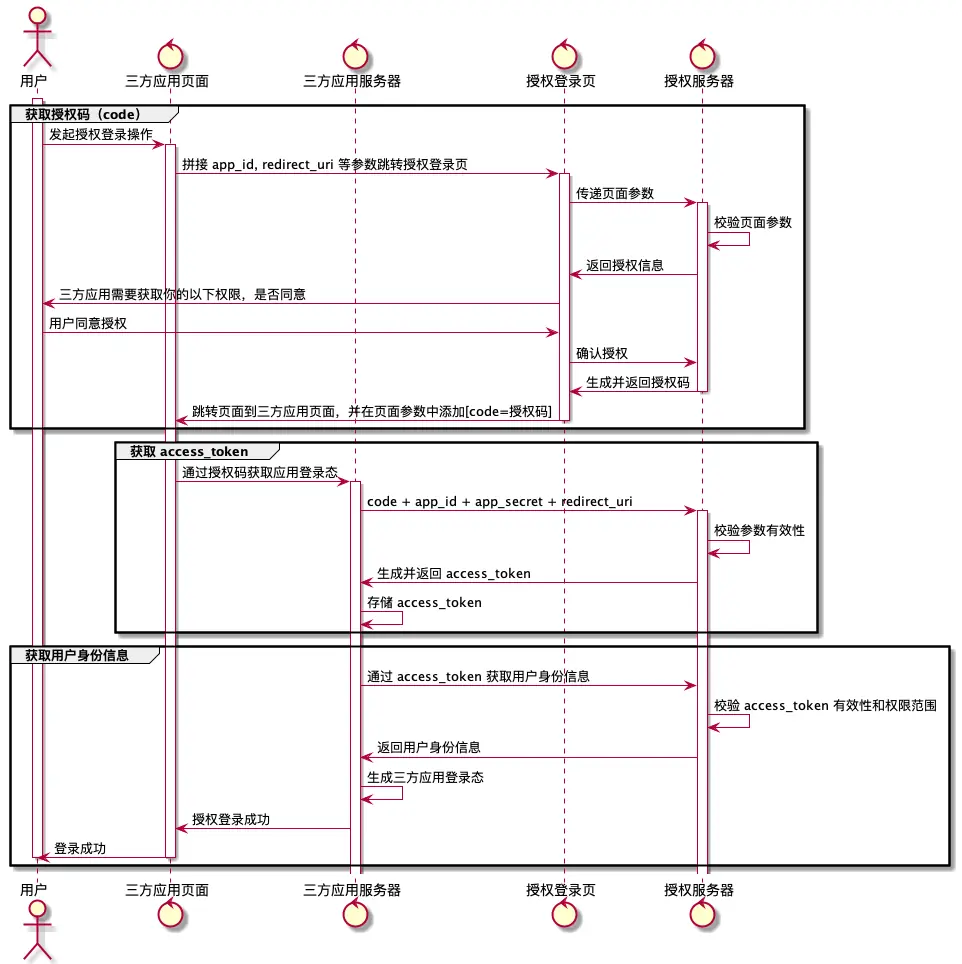
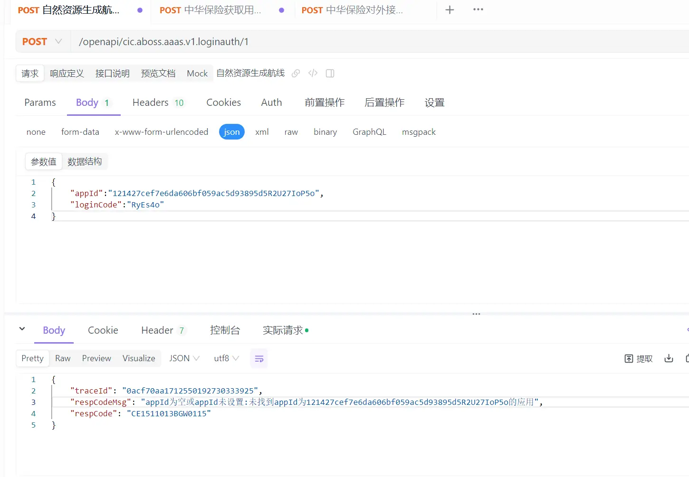
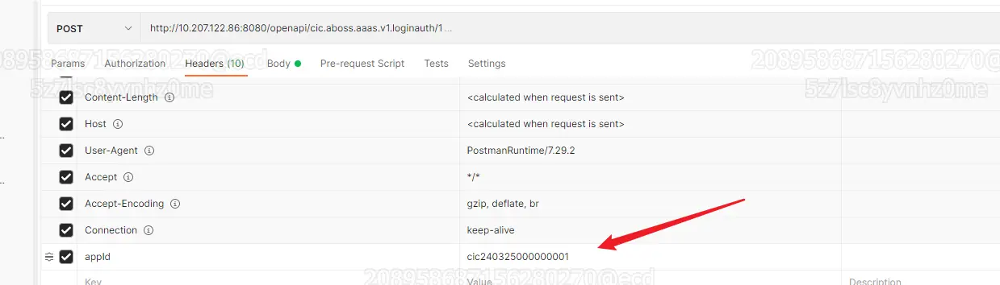
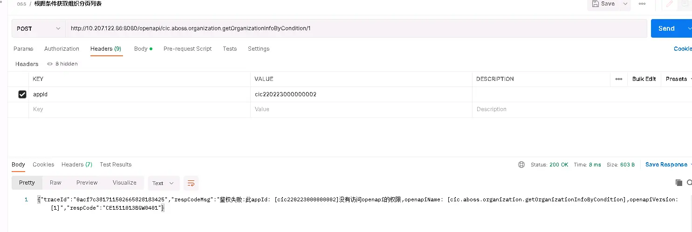
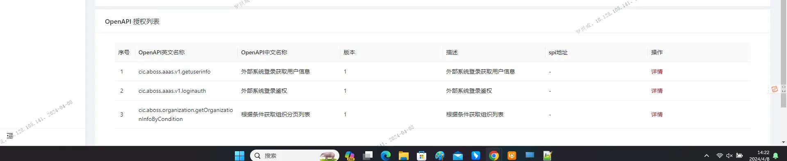
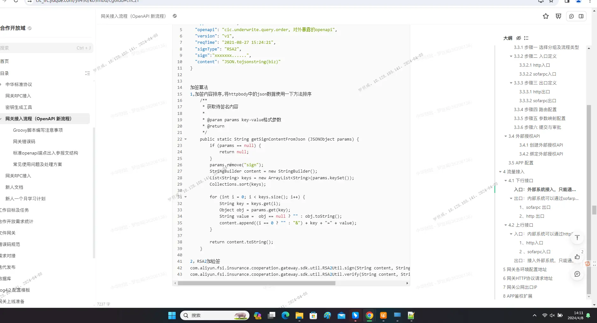

https://cic_irc.yuque.com/tyl581/ggwv9w/edgtw1il5byz421g

## 登录流程概述

新一代网页应用登录是基于 [OAuth 2.0](https://oauth.net/2/) 标准协议实现的，通过新一代账号授权登录第三方应用的能力。

### 时序图



## 准备工作

在使用网页应用登录能力之前，接入方需要准备好一个登录回调 URL ，如下所示：

例如：http://third-part.cic.inter/login/callback

作用：用于接收登录授权成功后的预授权码

将准备好的登录回调 URL 给到运营支撑域 [@陈伟力](https://cic_irc.yuque.com/chenweili-zn1cu) 用于在idass创建一个应用， 并获得应用的 ClientID 和登录授权页面地址（AuthorizeURL）。

## 获取登录授权码

三方应用需要请求用户身份验证时，需要跳转至准备阶段获取的登录授权页面地址。

用户在此页面确认登录授权之后会产生一个授权码。

以“无人机系统”对接网页应用登录为例：

当用户访问“无人机系统”的网页，三方应用需要判断用户是否登录，如果已经登录则允许用户继续访问，否则跳转到准备阶段获取的登录授权页面。

用户在登录授权页面输入完账号密码验证通过后，还会进行人脸的二次认证，如果都验证通过将会自动重定向回到三方应用的登录回调 URL ，并将授权码 code 通过 query 方式携带给三方应用供后续使用。

例如：http://third-part.cic.inter/login/callback?code=asdfghjkl&state=zxccbnm

## 获取 token

将准备阶段获取的 ClientID 和上一步获取的授权码调用新一代接口，接口参考如下。

## 获取用户信息

将上一步获取的 token 调用新一代接口，接口参考如下。

## 对外API接口

三方应用调用新一代的所有接口都应该通过接入合作开放域网关方式调用接口。

合作开放域网关文档链接[https://cic_irc.yuque.com/yii456/ko5mbu/cg6ldd](https://cic_irc.yuque.com/yii456/ko5mbu/cg6ldd)

合作开放域网关对接人-陈继蒙

### 获取token（需要加签）

**URL:** `/openapi/cic.aboss.aaas.v1.loginauth/1`

**Type:** `POST`

**Content-Type:** `application/json; charset=utf-8`

**Description:** 出口唯一标识符:cic.aboss.aaas.v1.loginauth

**Body-parameters:**

|   |   |   |   |   |
|---|---|---|---|---|
|Parameter|Type|Description|Required|Since|
|appId|string|登录appId|true|-|
|loginCode|string|oauth2登录code|true|-|

**Request-example:**

```
curl -X POST -H 'Content-Type: application/json; charset=utf-8' -i /openapi/cic.aboss.aaas.v1.loginauth/1 --data '{
  "appId": "4",
  "loginCode": "974"
}'
```

**Response-fields:**

|   |   |   |   |
|---|---|---|---|
|Field|Type|Description|Since|
|key|string|登录成功返回的token键|-|
|value|string|登录成功返回的token值|-|
|expires|int64|token超时时间(秒)|-|

**Response-example:**

```
{
  "accessToken": "20x2s2",
  "key": "5ot72u",
  "value": "f8z1cu",
  "expires": 694
}
```

### 获取用户信息（需要加签）

**URL:** `/openapi/cic.aboss.aaas.v1.getuserinfo/1`

**Type:** `POST`

**Content-Type:** `application/json; charset=utf-8`

**Description:** 出口唯一标识符:cic.aboss.aaas.v1.getuserinfo

**Body-parameters:**

|   |   |   |   |   |
|---|---|---|---|---|
|Parameter|Type|Description|Required|Since|
|loginToken|string|登录token|true|-|

**Request-example:**

```
curl -X POST -H 'Content-Type: application/json; charset=utf-8' -i /openapi/cic.aboss.aaas.v1.getuserinfo/1 --data '{
  "第一个接口返回的key": "第一个接口返回的value"
}'
```

**Response-fields:**

|   |   |   |   |
|---|---|---|---|
|Field|Type|Description|Since|
|accRole|string|账户角色(1-普通用户，2-超管)|-|
|accType|string|账户类型(0-内部，1-外部)|-|
|accId|string|账户Id|-|
|username|string|账户名称（登录账户名）|-|
|personNo|string|员工编号|-|
|personName|string|人员名称|-|
|sub|string|账户Id|-|

**Response-example:**

```
{
  "accRole": "mnruhw",
  "accType": "5gynor",
  "accId": "4",
  "username": "morton.gleichner",
  "personNo": "yybyd3",
  "personName": "morton.gleichner",
  "permissionCode": "974",
  "sub": "7r0wz1",
  "channelType": "55fbbk"
}
```

## 常见问题

### 1. appId为空或appId未设置：未找到appId为xxxxx的应用

如图：

原因及解决办法：

1. headers中的appId对应的应用未创建，需要在中华网关对应环境创建外部应用
2. 地址错误，如：cft的请求地址填写到pft的地址
3. 外部应用已创建，但appId填写错误

### 2. 鉴权失败：此appId【xxxxxxx】没有访问openapi的权限，OpenAPIName：【xxxxxx】

如图：

原因及解决办法：

中华网关上创建的应用未授权本次请求的api，需要先授权



### 3. 加签相关问题

原因及解决办法：

中华网关上创建应用时需要配置开启签名算法，配置好公钥私钥，对请求加签。

方法如下，具体可联系中华网关的老师进行对接，合作开放域网关文档链接[https://cic_irc.yuque.com/yii456/ko5mbu/cg6ldd](https://cic_irc.yuque.com/yii456/ko5mbu/cg6ldd)


