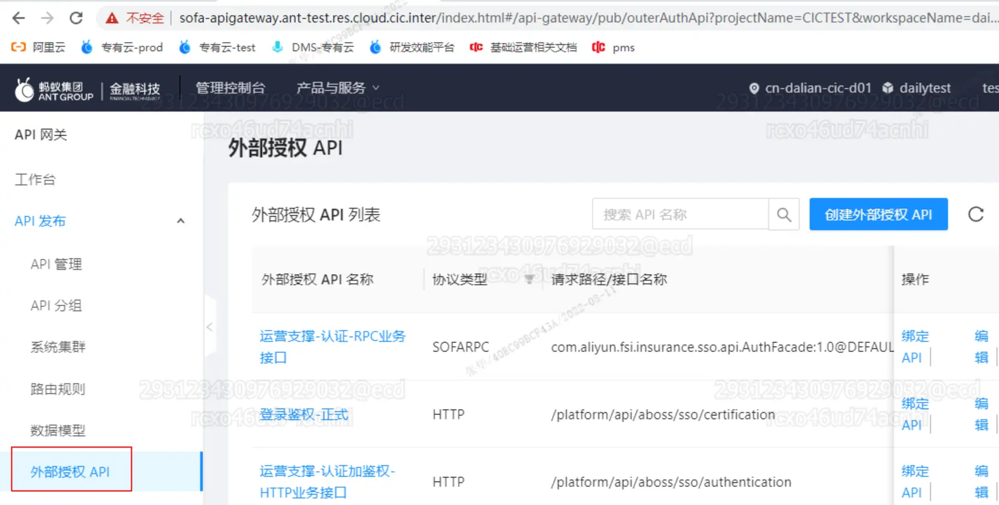
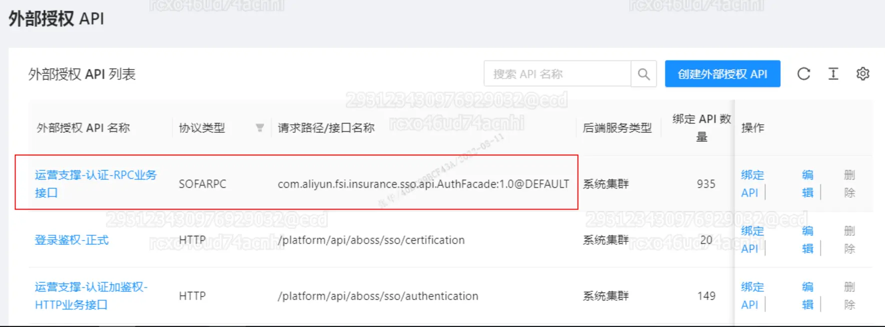
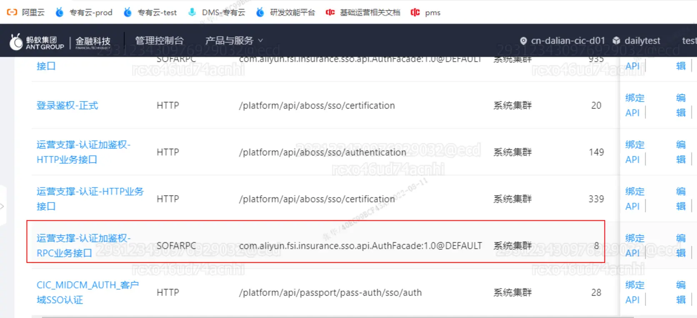
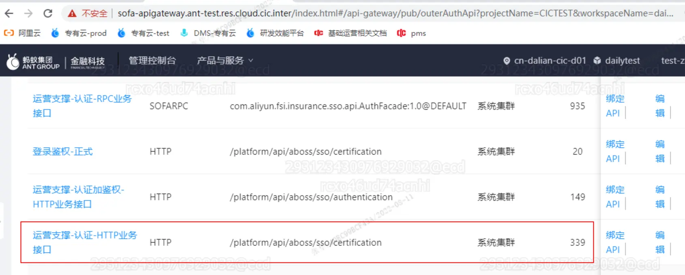
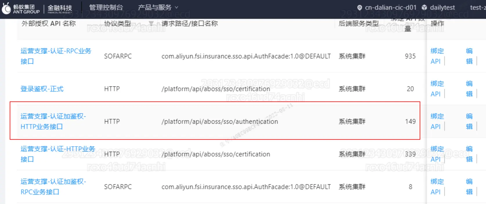

https://cic_irc.yuque.com/tyl581/ggwv9w/sxdb0g

## 概述

新一代内部系统的前端框架已经自动集成登录能力。

以下描述针对新一代后端服务如何获取当前登录账号信息。

## 关键术语

- 认证：只会判断用户是否已经登录认证，不会做接口是否能被调用权限检查。
- 认证加鉴权：需要在权限中心配置权限码，不仅会做登录认证，还会做接口是否有权限调用检查。

## 后端服务接入

后端提供的api接口需要在sofa的api-gateway上进行外部授权绑定，由于后端提供的接口协议可能是RPC或者REST（HTTP）协议，提供两种不同的接入方式。



### RPC接入方式

#### 认证



#### 认证加鉴权



#### 获取用户信息

```
/**
* 用户统一登陆信息
*/
String authData = RpcInvokeContext.getContext().getRequestBaggage( "authData");
LogUtils.logger().info("用户登录信息 authData : {}", authData);
if (StringUtils.isBlank(authData)) {
    return new LoginUserInfo();
}
LoginUserInfo loginUserInfo = new LoginUserInfo();
try {
    loginUserInfo = JSON.parseObject(authData, LoginUserInfo.class);
} catch (Exception e) {
    LogUtils.logger().error("解析用户登录信息异常", e);
}
```

### REST接入方式

#### 认证



#### 认证加鉴权



#### 获取用户信息

```
/**
* 用户统一登陆信息
*/
String authData =request.getHeader( "authData");
LogUtils.logger().info("用户登录信息 authData : {}", authData);
if (StringUtils.isBlank(authData)) {
    return new LoginUserInfo();
}
LoginUserInfo loginUserInfo = new LoginUserInfo();
try {
    loginUserInfo = JSON.parseObject(authData, LoginUserInfo.class);
} catch (Exception e) {
    LogUtils.logger().error("解析用户登录信息异常", e);
}
```

### authData格式

```
/**
* 账户类型(0:内部账户，1:外部账户)
*/
private String accType;
/**
* 账号角色（1-普通用户，2-超管）
*/
private String accRole;
/**
* 账户Id
*/
public String accId;
/**
* 账户名称
*/
public String username;
/**
* 员工编号
*/
private String personNo;
/**
* 人员名称
*/
public String personName;
/**
* 授权码
*/
public String permissionCode;
/**
* 账户Id
*/
private String sub;
```

认证:获取用户信息,authData中不包含permissionCode

认证加鉴权:认证并判断用户是否有访该资源的权限，authData包含所有字段

personName是中文名，在http方式下获取的是经过url编码处理的，需要做解码处理URLDecoder.[decode](https://so.csdn.net/so/search?q=decode&spm=1001.2101.3001.7020)(personName, "UTF-8")

## 用户信息查询

[https://cic_irc.yuque.com/tyl581/ggwv9w/xhap0wi0mdbab9sa](https://cic_irc.yuque.com/tyl581/ggwv9w/xhap0wi0mdbab9sa)
