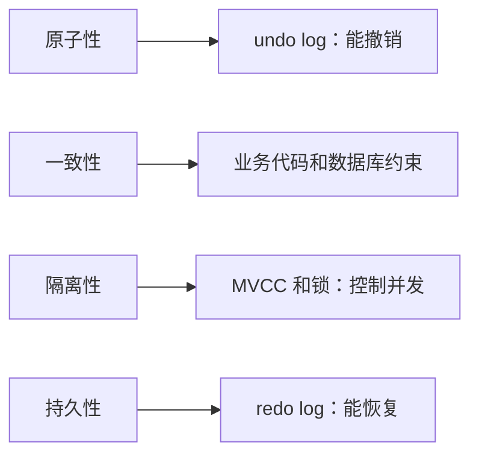

## 一、💡 一句话理解

> [!tip] 核心结论
> 事务就是把多条相关 SQL 当成一个整体：要么全部成功并提交，要么失败后全部撤销。本篇重点掌握 **ACID、undo/redo log、提交与回滚，以及事务边界**；并发可见性、MVCC 和锁单独放在 [[MySQL 隔离级别与锁]] 中学习。

最典型的例子是转账：A 扣 100 元和 B 加 100 元必须一起成功，不能只完成一半。

## 二、🧭 理论：事务是什么

### 2.1 为什么需要事务

假设转账分成两条 SQL：

```text
A 账户扣 100 元
→ 程序或数据库突然异常
→ B 账户还没增加 100 元
```

如果没有事务，系统会留下错误的中间状态。放进同一个事务后，结果只有两种：

```text
全部成功 → COMMIT，永久保存
中途失败 → ROLLBACK，撤销本次修改
```

### 2.2 事务的边界

一个显式事务通常由三部分组成：

```sql
START TRANSACTION; -- 开始事务

-- 在这里执行多条相关 SQL

COMMIT;            -- 全部成功，提交
-- 或 ROLLBACK;    -- 任一步失败，回滚
```

MySQL 默认开启 `autocommit`。不显式开启事务时，每条成功执行的 SQL 通常都会成为一个独立事务并自动提交。

> [!warning] 常见误区
> 连续执行两条 `UPDATE`，不代表它们天然属于同一个事务。要么显式使用 `START TRANSACTION`，要么由 Spring 等框架在同一个数据库连接上管理事务边界。

## 三、⚙️ 理论：事务怎么工作

### 3.1 ACID 四个特性

| 特性 | 它关心什么 | 白话解释 | 转账例子 |
| --- | --- | --- | --- |
| 原子性（Atomicity） | 这些操作有没有一起成功或一起失败 | 保证事务做完整，不能只执行一半 | A 扣款和 B 加款必须一起成功；任一步失败，两步都要回滚 |
| 一致性（Consistency） | 全部成功以后，结果对不对 | 保证事务完成后的数据仍符合业务规则和数据库约束 | A 扣 100 元，B 必须增加 100 元，总金额仍然不变 |
| 隔离性（Isolation） | 多个事务并发执行时会不会互相干扰 | 一个事务不应随意看到或破坏另一个未完成事务的中间状态 | 两笔转账同时修改同一账户时，不能因为互相覆盖而算错余额 |
| 持久性（Durability） | 已经提交的结果会不会丢 | 事务提交成功后，即使数据库重启也应保留结果 | 系统返回转账成功后，数据库宕机重启也不能恢复成转账前的余额 |

> [!warning] 原子性不等于一致性
> 原子性解决“有没有完整地做完”，一致性解决“完整做完以后结果对不对”。例如 A 扣 100 元、B 只增加 50 元，两条 SQL 可以一起成功提交，满足原子性；但总金额凭空少了 50 元，结果不正确，因此不满足一致性。

**一致性是最终目标，不是数据库自动理解所有业务规则。** 数据库用原子性、隔离性、持久性、唯一约束和外键等能力提供保障，应用仍要正确编写业务逻辑。

### 3.2 InnoDB 靠什么实现事务

ACID 不是“一项特性只对应一个组件”。多个机制需要一起工作：

| 特性 | 主要实现手段 | 解决的问题 |
| --- | --- | --- |
| 原子性 | undo log、`COMMIT`、`ROLLBACK`、崩溃恢复 | 事务中的操作必须全部成功或全部失败 |
| 一致性 | 正确的业务代码、数据库约束，再加上其他三个特性 | 事务完成后的数据必须符合业务规则和数据库约束 |
| 隔离性 | MVCC、锁、隔离级别 | 并发事务不能产生错误干扰 |
| 持久性 | redo log、WAL、日志持久化和崩溃恢复 | 已经提交的数据不能因为宕机而丢失 |

#### 3.2.1 原子性：undo log 和回滚

原子性关心：**这些操作有没有一起成功或一起失败。**

修改数据时，InnoDB 会写入用于撤销修改的 undo log。事务失败或执行 `ROLLBACK` 时，可以根据其中的信息恢复修改前的数据。

例如余额原来是 `1000`，事务把它改成 `900`：

```text
修改前：undo log 保留用于恢复“余额 1000”的信息
修改中：当前数据变成“余额 900”
事务失败：根据 undo log 撤销修改，余额恢复为 1000
```

所以转账中的扣款成功、加款失败时，数据库可以撤销前面的扣款，避免只完成一半。

> [!tip] 一句话记忆
> 原子性主要通过事务边界、undo log 和回滚机制实现，保证事务不会只做一半。

#### 3.2.2 一致性：约束和正确的业务逻辑

一致性关心：**事务全部成功以后，结果对不对。**

一致性没有一个单独的“consistency log”。它是事务最终要达到的目标，需要多种能力共同保证：

```text
正确的业务代码
+ 数据库约束
+ 原子性、隔离性和持久性
→ 共同保证一致性
```

数据库可以用下面的约束阻止一部分错误数据：

| 数据库约束 | 作用 |
| --- | --- |
| `PRIMARY KEY` | 主键不能重复，也不能为 `NULL` |
| `UNIQUE` | 指定值不能重复 |
| `NOT NULL` | 必填字段不能为 `NULL` |
| `CHECK` | 数据必须满足指定条件，例如余额不能小于 0 |
| `FOREIGN KEY` | 被引用的关联数据必须存在 |

但数据库不知道所有业务含义。例如“A 扣 100 元，B 必须增加 100 元”需要应用代码正确实现。A 扣 100、B 只加 50，即使两条 SQL 一起提交并满足原子性，结果仍然不一致。

> [!tip] 一句话记忆
> 一致性没有单独的底层组件，它由业务代码、数据库约束以及其他事务特性共同保证。

#### 3.2.3 隔离性：MVCC、锁和隔离级别

隔离性关心多个事务并发执行时会不会互相干扰。InnoDB 使用隔离级别规定可见性，使用 MVCC 减少普通读写阻塞，再使用锁控制当前读和写入冲突。

这部分涉及脏读、不可重复读、幻读、Read View 和各种锁，统一放在 [[MySQL 隔离级别与锁]] 中学习。

> [!tip] 一句话记忆
> MVCC 主要服务普通快照读，锁主要处理当前读和写入冲突。

#### 3.2.4 持久性：redo log 和 WAL

持久性关心：**事务已经提交，数据库突然宕机后，结果还在不在。**

InnoDB 主要使用 redo log 和 WAL 保证持久性。WAL 是 Write-Ahead Logging，也就是**预写日志**：数据页可以稍后写回磁盘，但提交事务所需的 redo log 必须按配置先持久化。

```text
执行 UPDATE
→ 在内存中修改数据页
→ 生成 redo log
→ COMMIT 时按配置持久化日志
→ 返回提交成功
→ 数据页之后再写入数据文件
```

如果事务提交后、数据页写入磁盘前发生宕机，MySQL 重启时可以重放 redo log，恢复已经提交但还没有完整写入数据文件的修改。

> [!tip] 一句话记忆
> 持久性主要通过 redo log、预写日志和崩溃恢复实现，保证已经提交的数据在数据库重启后仍然存在。

把这些机制连起来记：



> [!info] undo log 和 redo log 不要说反
> undo log 主要解决“怎么撤回、怎么读旧版本”；redo log 主要解决“提交后的修改在故障后怎么恢复”。

### 3.3 COMMIT、ROLLBACK 和 SAVEPOINT

| 命令 | 作用 |
| --- | --- |
| `COMMIT` | 提交当前事务，使修改永久生效，并释放事务持有的 InnoDB 锁 |
| `ROLLBACK` | 撤销整个事务的修改，并释放事务持有的 InnoDB 锁 |
| `SAVEPOINT name` | 在事务中设置保存点 |
| `ROLLBACK TO SAVEPOINT name` | 只撤销保存点之后的修改，不结束整个事务 |

保存点适合一个大事务中允许局部失败的场景，但业务代码中不要为了“方便”把事务无限做大。

### 3.4 事务的常见边界问题

- **长事务**：长时间不提交会占用锁，也可能让旧版本和 undo log 长时间无法清理。
- **DDL 隐式提交**：`CREATE TABLE`、`ALTER TABLE` 等语句可能触发隐式提交，不能简单认为所有语句都能回滚。
- **并发冲突与死锁**：详细原理和处理方式见 [[MySQL 隔离级别与锁]]。
- **跨系统操作**：本地数据库事务不能自动回滚已经发送的 HTTP 请求或普通 MQ 消息，需要幂等、补偿、本地消息表或分布式事务方案。

## 四、🚀 实践：完成一笔安全转账

### 4.1 前置准备

- MySQL 8.0 或 8.4。
- 表必须使用支持事务的 InnoDB 存储引擎。
- 下面包含建表和写入 SQL，只能在个人测试库练习；共享库或生产库必须先确认影响范围并做好备份。

可以先执行只读查询确认配置：

```sql
-- 查看当前连接是否自动提交。
SELECT @@autocommit;

-- 查看当前会话的事务隔离级别。
SELECT @@transaction_isolation;

-- 查看目标表使用的存储引擎。
SHOW TABLE STATUS LIKE 'account';
```

### 4.2 可以拿来干什么

事务适合“多个数据库修改必须共同成功”的场景，例如：

- 转账：扣减付款方余额，同时增加收款方余额。
- 创建订单：写入订单，同时扣减库存。
- 发放权益：写入发放记录，同时更新领取状态。

事务不适合包住耗时的远程调用。推荐先缩小数据库事务范围，再为远程操作设计超时、重试、幂等和补偿。

### 4.3 完整实践：转账、提交和验证

先在个人测试库准备数据：

```sql
-- 建立账户表。InnoDB 才能提供本文讨论的事务能力。
CREATE TABLE account (
    id BIGINT PRIMARY KEY,
    name VARCHAR(50) NOT NULL,
    balance DECIMAL(12, 2) NOT NULL,
    CHECK (balance >= 0)
) ENGINE = InnoDB;

-- 准备两个测试账户。
INSERT INTO account(id, name, balance) VALUES
(1, '账户 A', 1000.00),
(2, '账户 B', 500.00);
```

执行一笔 100 元转账：

```sql
-- 显式开始事务，后续修改不会被逐条自动提交。
START TRANSACTION;

-- 条件更新保证余额足够时才扣款。
UPDATE account
SET balance = balance - 100.00
WHERE id = 1
  AND balance >= 100.00;

-- 应用必须检查上一条 SQL 的影响行数为 1。
-- 如果为 0，说明账户不存在或余额不足，应执行 ROLLBACK。

-- 给收款方增加余额。
UPDATE account
SET balance = balance + 100.00
WHERE id = 2;

-- 应用也要检查影响行数为 1；全部成功后才能提交。
COMMIT;
```

使用只读查询验证结果：

```sql
SELECT id, name, balance
FROM account
ORDER BY id;
```

预期结果：

```text
账户 A：900.00
账户 B：600.00
总金额仍为 1500.00
```

如果第二条更新失败，应执行：

```sql
ROLLBACK;
```

回滚后，A 的扣款也会撤销，不会留下“钱扣了但对方没收到”的中间状态。

## 五、🎤 高频面试题

### 5.1 什么是事务

> 事务是一组不可分割的数据库操作，要么全部提交，要么全部回滚。它通过 ACID 保证数据可靠性。以转账为例，扣款和加款必须放在同一个事务里，避免只成功一半。

### 5.2 MySQL 如何实现事务

> InnoDB 使用 undo log 支持回滚和历史版本，使用 redo log 支持崩溃恢复和持久性，使用 MVCC 提高并发读取能力，再用锁处理写冲突和锁定读。

### 5.3 为什么不建议长事务

> 长事务会长时间占用锁和连接，还会让旧版本不能及时清理，增加 undo 空间与并发冲突。事务中不要做无关计算、等待用户输入或耗时远程调用。

### 5.4 Spring 的事务和 MySQL 事务是什么关系

> [!tip] 一句话理解
> **Spring 是事务管理员，MySQL InnoDB 才是实际干活的人。** Spring 决定什么时候开始、提交或回滚；MySQL 真正负责修改数据、加锁、记录 undo/redo log 和完成崩溃恢复。

#### 5.4.1 `@Transactional` 帮我们做了什么

不使用 Spring 时，JDBC 代码需要手动管理事务：

```java
Connection connection = dataSource.getConnection();

try {
    // 关闭自动提交：后面的 SQL 先属于同一个事务，不再执行一条就提交一条。
    connection.setAutoCommit(false);

    // 两个操作必须使用同一个数据库连接。
    decreaseBalance(connection);
    increaseBalance(connection);

    // 两个操作全部成功，通知 MySQL 提交事务。
    connection.commit();
} catch (Exception e) {
    // 任一步失败，通知 MySQL 撤销本次事务中的修改。
    connection.rollback();
    throw e;
} finally {
    connection.close();
}
```

使用 Spring 后，可以把重复的事务控制交给 `@Transactional`：

```java
@Service
public class TransferService {

    @Transactional(rollbackFor = Exception.class)
    public void transfer() {
        // A 扣款。
        accountMapper.decreaseBalance(1L, 100);

        // B 加款；如果这里抛出异常，前面的扣款也要回滚。
        accountMapper.increaseBalance(2L, 100);
    }
}
```

可以把背后的流程简化为：

```text
外部调用 transfer()
→ Spring 代理拦截方法调用
→ Spring 取得数据库连接并开启事务
→ 两条 SQL 加入同一个事务
→ 方法正常结束：Spring 通知 MySQL COMMIT
→ 方法异常结束：Spring 按回滚规则通知 MySQL ROLLBACK
→ Spring 释放数据库连接
```

Spring 管理的是**事务边界**，真正执行下面工作的仍然是 MySQL InnoDB：

```text
Spring：什么时候开始、提交、回滚
MySQL：修改数据、加锁、写 undo/redo log、提交、回滚、崩溃恢复
```

#### 5.4.2 为什么要注意代理调用

Spring 默认使用 AOP 代理实现声明式事务。只有方法调用经过 Spring 代理，代理才有机会在方法执行前开启事务、执行后提交或回滚。

```text
Controller
→ Spring 代理对象
→ 开启事务
→ 真正的 TransferService 方法
→ 提交或回滚
```

下面的同类内部调用没有经过外面的 Spring 代理：

```java
@Service
public class OrderService {

    public void createOrder() {
        // 相当于 this.saveOrder()，没有经过 Spring 代理。
        saveOrder();
    }

    @Transactional
    public void saveOrder() {
        orderMapper.insertOrder();
    }
}
```

如果 `createOrder()` 本身没有事务，那么 `saveOrder()` 上的 `@Transactional` 在默认代理模式下不会单独开启事务。

> [!info] 不要说成“同类调用一定没有事务”
> 如果外层方法本来已经处于事务中，里面执行的数据库操作仍然可以加入外层事务。问题是内部调用没有经过代理，所以被调用方法上的事务配置不会被单独拦截和应用。

#### 5.4.3 为什么异常要继续抛出

Spring 代理需要根据方法的结束方式决定提交还是回滚：

```text
方法正常返回 → 提交
方法抛出符合回滚规则的异常 → 回滚
```

如果业务代码捕获异常后不再抛出，Spring 看到的可能只是“方法正常结束”：

```java
@Transactional(rollbackFor = Exception.class)
public void transfer() {
    try {
        accountMapper.decreaseBalance(1L, 100);
        accountMapper.increaseBalance(2L, 100);
    } catch (Exception e) {
        // 只记录日志，没有继续抛出异常。
        // Spring 代理可能认为方法正常结束，进而提交事务。
        log.error("转账失败", e);
    }
}
```

更稳妥的做法是让异常继续传递给 Spring，或者在确实需要捕获时主动把事务标记为回滚。

默认情况下，Spring 遇到 `RuntimeException` 或 `Error` 才会回滚，普通受检异常默认不回滚。希望所有 `Exception` 都触发回滚时，可以明确声明：

```java
@Transactional(rollbackFor = Exception.class)
public void transfer() throws Exception {
    accountMapper.decreaseBalance(1L, 100);
    accountMapper.increaseBalance(2L, 100);
}
```

#### 5.4.4 为什么要使用同一个数据库连接

MySQL 的本地事务依附于数据库连接。两条 SQL 使用同一个连接，才能属于同一个 MySQL 事务：

```text
同一个连接
├── A 扣款
└── B 加款
```

如果使用两个互不相关的连接，对 MySQL 来说就是两个事务：

```text
连接 1 → A 扣款 → 事务 1
连接 2 → B 加款 → 事务 2
```

事务 2 失败时，不能自动回滚事务 1 已经提交的修改。Spring 会把事务资源和当前执行上下文关联起来，让由同一个事务管理器管理的数据访问操作复用事务连接。

下面这些情况可能无法自动加入原事务：

- 新开线程或使用 `@Async` 执行数据库操作；
- 手动获取连接，绕过 Spring 的事务管理；
- 使用另一个没有加入当前事务的数据源；
- 调用远程 HTTP 服务或普通 MQ，因为本地 MySQL 事务不能控制远程系统。

#### 5.4.5 面试表达

> Spring 事务不是独立于数据库的另一种事务。它通过事务管理器和 AOP 代理，在业务方法执行前开启事务，正常结束时提交，出现符合规则的异常时回滚。真正的数据修改、锁、undo log、redo log 和提交回滚由 MySQL InnoDB 完成。使用 `@Transactional` 时要注意代理是否生效、异常是否传递给 Spring，以及相关数据库操作是否加入了同一个事务连接。

## 六、📌 快速回顾

```text
事务       = 多条 SQL 要么全成功，要么全失败
ACID       = 原子性、一致性、隔离性、持久性
undo log   = 回滚 + 历史版本
redo log   = 崩溃恢复 + 持久性
事务边界   = START TRANSACTION → COMMIT / ROLLBACK
```

最适合面试复述的一句话：

> MySQL InnoDB 事务用 ACID 保证可靠性，undo log 主要支持回滚，redo log 主要支持崩溃恢复；实际开发还要明确提交与回滚边界，并避免长事务。

相关笔记：[[MySQL 索引]]、[[MySQL 隔离级别与锁]]

## 七、🔗 官方资料

- [MySQL 8.4：InnoDB and the ACID Model](https://dev.mysql.com/doc/refman/8.4/en/mysql-acid.html)
- [MySQL 8.4：InnoDB Transaction Model](https://dev.mysql.com/doc/refman/8.4/en/innodb-transaction-model.html)
- [MySQL 8.4：autocommit、Commit 与 Rollback](https://dev.mysql.com/doc/refman/8.4/en/innodb-autocommit-commit-rollback.html)
- [MySQL 8.4：Redo Log](https://dev.mysql.com/doc/refman/8.4/en/innodb-redo-log.html)
- [MySQL 8.4：Undo Logs](https://dev.mysql.com/doc/refman/8.4/en/innodb-undo-logs.html)
- [Spring Framework：声明式事务的实现原理](https://docs.spring.io/spring-framework/reference/data-access/transaction/declarative/tx-decl-explained.html)
- [Spring Framework：使用 `@Transactional`](https://docs.spring.io/spring-framework/reference/data-access/transaction/declarative/annotations.html)
