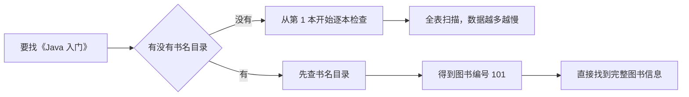
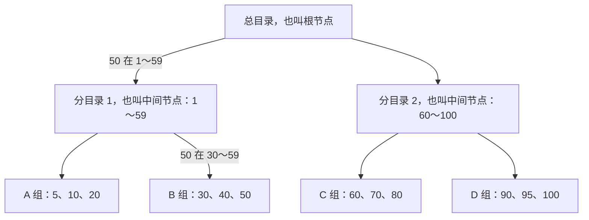
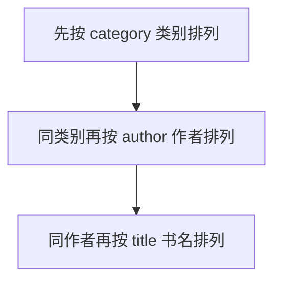

## 一、💡 一句话理解

> [!tip] 核心结论
> 索引就像一本书的目录：没有目录就要一页页翻，有目录就能先找到页码，再直接翻到目标内容。

面试先记住一句话：**索引用额外的存储空间和写入成本，换取更快的查询。**

## 二、📚 先看一个生活例子

### 2.1 没有索引：一本本找书

假设图书馆有 10 万本书，你要找《Java 入门》。

如果图书没有目录，你只能：

```text
第 1 本 → 不是
第 2 本 → 不是
第 3 本 → 不是
……
直到找到《Java 入门》
```

这就像数据库的**全表扫描**：从第一行开始检查，直到找完所有数据。

### 2.2 有索引：先查目录

如果图书馆有一份按书名排序的目录：

```text
《Java 入门》 → 图书编号 101
《MySQL 实战》→ 图书编号 205
《Redis 设计》→ 图书编号 309
```

现在找书分成两步：

1. 在书名目录中找到《Java 入门》，得到图书编号 `101`。
2. 根据编号 `101`，找到这本书的完整信息和位置。



### 2.3 图书馆和 MySQL 的对应关系

| 图书馆 | MySQL |
| --- | --- |
| 一本书的完整信息 | 表中的一行数据 |
| 书名目录 | 普通索引或二级索引 |
| 图书编号 | 主键 |
| 先查目录，再根据编号找书 | 先查二级索引，再回表 |
| 一本本翻找 | 全表扫描 |

## 三、⚙️ 索引到底怎么工作

### 3.1 先看完整关系

先不要把几个名词混在一起：

| 名称 | 白话理解 | 主要作用 |
| --- | --- | --- |
| MySQL | 整个数据库软件 | 接收 SQL，管理数据库和表 |
| 存储引擎 | MySQL 内部负责实际存取数据的模块 | 决定数据、索引、事务和锁怎么管理 |
| InnoDB | MySQL 默认使用的存储引擎 | 管理表数据，支持事务、行锁和崩溃恢复 |
| InnoDB 表 | 交给 InnoDB 管理的表 | 表的数据和索引由 InnoDB 保存 |
| 索引 | 表的快速查询目录 | 减少需要扫描的数据 |
| B+Tree | 组织常见索引的数据结构 | 让 InnoDB 快速定位和范围查找 |

把它们连起来就是：

```text
MySQL
└── 数据库
    └── 表
        └── 由 InnoDB 存储引擎管理
            ├── 保存表数据
            └── 建立索引
                └── 常见索引使用 B+Tree 组织
```

执行一条查询时，大致过程是：

```text
SQL 发给 MySQL
→ MySQL 分析 SQL 并选择执行方案
→ InnoDB 根据索引查找数据
→ B+Tree 帮助定位数据页
→ 查询结果返回给 MySQL
```

> [!tip] 一句话记忆
> MySQL 是整个系统，InnoDB 是负责存取表数据的模块，索引是查询目录，B+Tree 是组织这份目录的方法。

### 3.2 索引和 B+Tree 有什么关系

先把两个概念分开：

| 概念 | 白话理解 | 解决什么问题 |
| --- | --- | --- |
| 索引 | 数据库里的目录 | 用来加快查询 |
| B+Tree | 组织这份目录的方法 | 让 MySQL 能快速定位和范围查找 |

可以类比成一本书：

```text
索引     = 书后面的目录
B+Tree   = 目录按照什么结构排列
```

所以两者不是同一个东西。**索引是要实现的功能，B+Tree 是实现索引的一种数据结构。**

MySQL 可以使用不同结构实现不同索引。在常见的 InnoDB 表中，主键索引、普通索引和唯一索引通常使用 B+Tree；全文索引和空间索引则使用其他结构。

```text
为了加快查询
→ 建立索引
→ 索引需要一种便于查找的数据结构
→ InnoDB 常用 B+Tree
```

因此，下面先认清常见索引名称，再了解 B+Tree 长什么样。

#### 3.2.1 常见索引类型

先记住：**索引可以从不同角度分类，所以这些名称不是完全并列的。**

| 分类角度 | 常见类型 | 这个角度在问什么 |
| --- | --- | --- |
| 按叶子节点存什么 | 聚簇索引、二级索引 | 完整行数据放在哪里 |
| 按作用和限制 | 主键索引、普通索引、唯一索引、全文索引、空间索引 | 这个索引用来做什么 |
| 按使用几列 | 单列索引、联合索引 | 一个索引包含几列 |

面试最常问下面几种：

| 索引名称 | 大白话理解 |
| --- | --- |
| 主键索引 | 根据主键找数据；主键不能重复，也不能是空值。在 InnoDB 中，它通常也是聚簇索引 |
| 普通索引 | 只负责加快查询，不要求索引值唯一，例如给书名建立索引 |
| 唯一索引 | 一边加快查询，一边限制非空索引值不能重复，例如用户手机号 |
| 联合索引 | 把多列合在一个索引中，例如 `(类别, 作者, 书名)` |
| 全文索引 | 从大段文字中搜索词语，类似文章内容搜索 |
| 空间索引 | 查询地图坐标、区域等空间数据，普通业务较少使用 |

还有两个名字会经常出现：

- **聚簇索引**：叶子节点直接保存完整行数据。InnoDB 表通常只有一个，后面会单独讲。
- **二级索引**：聚簇索引以外的索引。普通索引、唯一索引和联合索引通常都属于二级索引。

例如，`(手机号)` 可以同时是“单列索引 + 唯一索引 + 二级索引”；`(类别, 作者)` 可以同时是“联合索引 + 普通索引 + 二级索引”。它们并不冲突，只是分类角度不同。

> [!tip] 面试先记住
> 最常见的是主键索引、普通索引、唯一索引和联合索引。聚簇索引与二级索引是在说明数据怎么存，不要和前面四种硬分成同一组。

### 3.3 B+Tree 的数据结构长什么样

B+Tree 这个名字可以先不记。先看 MySQL 怎么从 9 个编号里找到 `50`。

假设一页最多只放 3 个编号，MySQL 会把排好序的编号分成三组：

```text
A 组：5、10、20
B 组：30、40、50
C 组：60、70、80
```

然后再准备一张“总目录”，记录每个范围应该去哪个组：

| 要找的编号 | 应该去哪一组 |
| --- | --- |
| 小于 30 | A 组 |
| 30～59 | B 组 |
| 大于等于 60 | C 组 |

现在执行下面的查询：

```sql
SELECT * FROM book WHERE id = 50;
```

只需要三步：


用文字再走一遍：

1. 要找的编号是 `50`。
2. 总目录告诉我们：`50` 属于 `30～59`，应该去 B 组。
3. B 组只有 `30、40、50`，很快就能找到 `50`。

如果没有总目录，就要从 A 组开始，把 `5、10、20、30、40、50……` 一个个比较。

现在再把例子换成专业名称：

| 刚才的例子 | B+Tree 中的名称 | 作用 |
| --- | --- | --- |
| 总目录 | 根节点 | 告诉 MySQL 下一步应该去哪一组 |
| A、B、C、D 数据组 | 叶子节点 | 保存真正的索引记录 |
| 总目录放不下所有分组信息，再增加分目录 | 中间节点 | 数据特别多时，继续缩小范围 |

所以这棵简化的 B+Tree 实际上就是：



查找 `50` 时只走这条路线：**总目录 → 分目录 1 → B 组 → 找到 50**。其他分目录和数据组不用检查。

> [!tip] 只需要记住
> B+Tree 就是“总目录 + 分组数据”。查询时先用总目录确定去哪一组，再到那一组里找具体数据。数据特别多时，会在总目录和数据组之间再增加几层目录。

上面的数字是为了理解而设计的简化案例。真实 MySQL 的一个节点能够保存很多索引值，但查找思路是一样的。

#### 3.3.1 数据库具体怎么分

先别想数据库，可以把它想成一个放号码卡的仓库：

- **索引记录**：一张张排好顺序的号码卡。
- **数据页**：装号码卡的盒子。InnoDB 的数据页默认是 16KB。
- **上层目录**：记录“从哪个号码开始，要去哪个盒子找”。

假设每个盒子最多放 `4` 张卡片，现在有：

```text
数据页 A：[10、20、30、40]  ← 已经装满
```

这时再放入 `50`，A 已经塞不下了。MySQL 会拿一个新盒子 B，把这批卡片分开放：

```text
数据页 A：[10、20]
数据页 B：[30、40、50]
```

多出 B 后，目录也要记住它：

```text
10 → 去数据页 A
30 → 去数据页 B
```

以后再有新的数据页，目录就继续增加记录。如果目录自己也放满了，在这个简化例子里，MySQL 就把目录也拆成两页，再在上面增加一张“总目录”。

整个过程只要记住四步：

```text
号码卡越来越多
→ 一个数据页装满，拆成两个数据页
→ 上层目录记下新数据页的位置
→ 目录页也满了，再拆目录并增加一层
```

下面这张图，就是把这个过程完整画出来：


> [!tip] 一句话记忆
> 一个数据页满了，通常会由一页拆成两页；每多一个数据页，上层目录就要多记一个位置；目录页没有空间记录新位置时，目录也会分裂，B+Tree 就会长高一层。

真实边界取决于索引值、记录大小、页面剩余空间和插入顺序，不是提前固定好的。

### 3.4 B+Tree：一层层缩小范围

数据较少时，一张总目录就够了。真实数据库可能有几百万行，一张目录放不下所有分组信息，于是 MySQL 会增加“分目录”。


每经过一层目录，就会排除大量不相关的数据。这就是“一层层缩小范围”。

B+Tree 适合数据库的原因，面试说出下面三点就够了：

- 每个节点能保存很多目录项，所以树通常不高。
- 查找时逐层缩小范围，减少磁盘读取。
- 最下面的数据按顺序排列，适合范围查询。

### 3.5 主键索引：编号后面就是完整数据

假设有一张图书表：

```text
book(id, title, author, shelf)
```

**叶子节点，就是 B+Tree 最底下的那一层。**

把 B+Tree 想成一棵倒过来的树：

```text
最上面：根节点       → 总目录
中间：中间节点       → 分目录
最下面：叶子节点     → 真正存放索引记录的地方
```

之所以叫“叶子”，是因为它已经到了树的末端，下面不会再连接其他节点。上面的根节点和中间节点主要负责带路，最后真正要找的内容在叶子节点中。

对于 InnoDB 的**主键索引**，叶子节点中放的是“主键 + 完整行数据”。例如：

```text
叶子节点中的一条记录：
101 → Java 入门、张老师、A-03 书架
```

`id` 是主键。InnoDB 的主键索引叶子节点保存完整行数据，所以通过主键找书时，可以直接拿到书名、作者和书架位置。


#### 3.5.1 聚簇索引是什么

**聚簇索引，就是把索引和完整行数据放在一起。**

还是用图书馆来理解：普通目录只告诉你书在哪里；聚簇索引更像书架本身已经按照图书编号排好，找到编号时，完整的书也就在这里。

在 InnoDB 的主键索引中，最下面的叶子节点大致可以理解成：

```text
101 → [Java 入门，张老师，A-03]
205 → [MySQL 实战，李老师，B-05]
309 → [Redis 设计，王老师，B-08]
```

左边的 `101、205、309` 是主键，右边是对应的完整行数据。因此，按照主键查询时，找到主键索引的叶子节点，就已经拿到了完整数据，不需要再去别的地方找一次。

```text
聚簇索引
= 按主键排好的 B+Tree
= 叶子节点直接保存完整行数据
```

一张表的完整数据只能按照一种主要方式组织，所以一张 InnoDB 表通常只有一个聚簇索引。表有主键时，主键索引通常就是聚簇索引。

> [!tip] 不同索引的叶子里放的东西不同
> 主键索引的叶子节点保存完整行数据；普通索引的叶子节点主要保存“索引列 + 主键值”，下一节会接着讲。

### 3.6 二级索引和回表：先拿编号，再找完整数据

现在给 `title` 建一个普通索引：

```sql
CREATE INDEX idx_title ON book(title);
```

这个书名索引的叶子节点主要保存：

```text
书名 + 主键 id
```

执行下面的查询：

```sql
SELECT * FROM book WHERE title = 'Java 入门';
```

查找过程如下：


最后“再去主键索引查一次”的动作，就叫**回表**。

> [!tip] 面试记法
> 二级索引像书名目录，目录里记录了图书编号；根据编号再去拿完整图书信息，就是回表。

### 3.7 覆盖索引：目录里的信息已经够了

如果只查询主键：

```sql
SELECT id FROM book WHERE title = 'Java 入门';
```

书名索引中已经有 `title` 和 `id`，可以直接返回结果，不需要再去主键索引拿完整行。这就是**覆盖索引**。


一句话区分：

- 需要索引之外的列：回表。
- 查询需要的列都在索引中：覆盖索引，不回表。

### 3.8 联合索引：像按“类别、作者、书名”排目录

假设建立联合索引：

```sql
CREATE INDEX idx_category_author_title
ON book(category, author, title);
```

它的排列方式是：



因此下面这些条件容易利用该索引查找：

```sql
WHERE category = '编程'

WHERE category = '编程' AND author = '张老师'

WHERE category = '编程'
  AND author = '张老师'
  AND title = 'Java 入门'
```

但如果只查：

```sql
WHERE author = '张老师'
```

就像你拿到的是一份“先按类别排列”的目录，却跳过类别直接找作者。不同类别下都可能有张老师，只能到处翻，无法很好地利用这份目录快速定位。

这就是**最左前缀原则**：联合索引 `(a, b, c)` 通常要从最左边的 `a` 开始使用。

### 3.9 为什么不能给每列都建索引

目录也需要维护。每新进一本书，不但要把书放到书架，还要更新书名目录、作者目录、类别目录。

数据库也是一样：

- 索引会占用磁盘空间。
- 新增、修改、删除数据时，也要更新索引。
- 索引越多，写入成本越高。

所以不是索引越多越好，而是要为**经常查询、确实能减少扫描**的条件设计索引。

## 四、🚀 实践：看懂一次 EXPLAIN

### 4.1 前置准备

下面 SQL 包含建表、写入和建索引，只能在个人测试库中练习，不要直接在共享库或生产库执行。

### 4.2 创建最小示例

```sql
-- 创建图书表。
CREATE TABLE book (
    id BIGINT PRIMARY KEY AUTO_INCREMENT,
    title VARCHAR(100) NOT NULL,
    author VARCHAR(50) NOT NULL,
    category VARCHAR(30) NOT NULL,
    shelf VARCHAR(20) NOT NULL
) ENGINE = InnoDB;

-- 插入几本测试图书。
INSERT INTO book(title, author, category, shelf) VALUES
('Java 入门', '张老师', '编程', 'A-03'),
('MySQL 实战', '李老师', '数据库', 'B-05'),
('Redis 设计', '王老师', '数据库', 'B-08');

-- 建立书名索引。
CREATE INDEX idx_title ON book(title);
```

### 4.3 查看是否使用索引

```sql
EXPLAIN SELECT *
FROM book
WHERE title = 'Java 入门';
```

入门阶段先看三个字段：

| 字段 | 白话解释 |
| --- | --- |
| `key` | MySQL 最终使用了哪个索引；看到 `idx_title` 表示选了书名索引 |
| `rows` | 预计需要检查多少行，数值越小通常越好 |
| `Extra` | 补充说明；看到 `Using index` 通常表示使用了覆盖索引 |

> [!warning] 数据太少时的正常现象
> 示例只有三行，MySQL 可能认为直接扫描全表更便宜，因此不一定选择索引。索引是否有价值要结合真实数据量和执行计划判断。

## 五、🎤 面试怎么回答

### 5.1 什么是索引

> 索引类似书的目录，是数据库为加快查询建立的有序数据结构。没有索引可能需要全表扫描；有索引可以快速缩小查找范围。它会占用额外空间，增删改时也要维护，所以不是越多越好。

### 5.2 为什么使用 B+Tree

> B+Tree 每个节点能保存很多索引项，因此树比较矮，查找时磁盘读取次数少；叶子节点又是有序的，所以既适合等值查询，也适合范围查询。

### 5.3 什么是回表和覆盖索引

> InnoDB 的二级索引保存索引列和主键值。先查二级索引拿到主键，再去主键索引拿完整行叫回表；如果查询需要的列在二级索引中已经都有了，就能直接返回，这叫覆盖索引。

### 5.4 什么是最左前缀原则

> 联合索引 `(a,b,c)` 是先按 `a` 排序，`a` 相同时再按 `b`，最后按 `c`，所以通常需要从最左边的 `a` 开始使用。跳过 `a` 直接查 `b`，无法很好地利用这份索引快速定位。

## 六、📌 快速回顾

```text
索引       = 书的目录
全表扫描   = 从第一页开始逐页翻
主键索引   = 编号后面直接放完整数据
二级索引   = 目录中保存“索引列 + 主键”
回表       = 目录拿到主键后，再找完整数据
覆盖索引   = 目录中的信息已经够用，不必回表
联合索引   = 多级目录，要从最左边开始查
EXPLAIN    = 查看 MySQL 准备怎么执行 SQL
```

最适合面试复述的一句话：

> 索引通过有序的 B+Tree 减少数据扫描；InnoDB 二级索引查完整行可能需要回表，覆盖索引可以避免回表；联合索引要注意最左前缀，最后用 `EXPLAIN` 验证实际执行计划。

相关笔记：[[MySQL 事务]]、[[MySQL 隔离级别与锁]]

## 七、🔗 官方资料

- [MySQL 8.4：Setting the Storage Engine](https://dev.mysql.com/doc/refman/8.4/en/storage-engine-setting.html)
- [MySQL 8.4：CREATE INDEX Statement](https://dev.mysql.com/doc/refman/8.4/en/create-index.html)
- [MySQL 8.4：How MySQL Uses Indexes](https://dev.mysql.com/doc/refman/8.4/en/mysql-indexes.html)
- [MySQL 8.4：Multiple-Column Indexes](https://dev.mysql.com/doc/refman/8.4/en/multiple-column-indexes.html)
- [MySQL 8.4：Clustered and Secondary Indexes](https://dev.mysql.com/doc/refman/8.4/en/innodb-index-types.html)
- [MySQL 8.4：The Physical Structure of an InnoDB Index](https://dev.mysql.com/doc/refman/8.4/en/innodb-physical-structure.html)
- [MySQL 8.4：Optimizing Queries with EXPLAIN](https://dev.mysql.com/doc/refman/8.4/en/using-explain.html)
