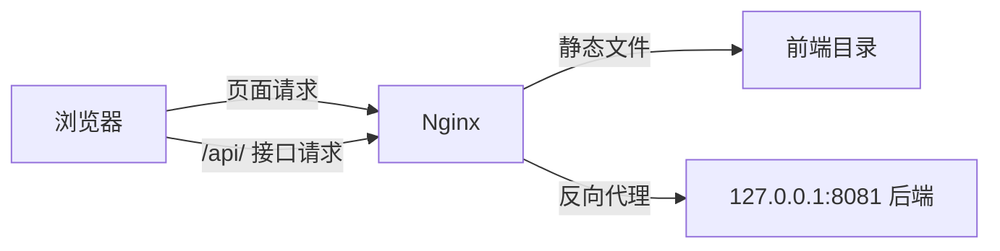

## 一、💡 一句话理解

> [!tip] 核心结论
> 截图中的内容是宝塔面板管理的一段 Nginx 站点配置，不是 Nginx 源码。它让 Nginx 对外接收请求：普通页面返回前端静态文件，`/api/` 请求转发给本机 `8081` 端口的后端服务。


> [!info] 阅读路线
> 先看懂“请求从哪里来”，再看 Nginx 如何分流，最后用 `nginx -t`、`curl` 和日志排错。整篇只需要抓住一条主线：**页面找文件，接口找后端**。

## 二、🧭 理论：它是什么

### 2.1 核心概念

Nginx 可以理解为网站门口的“接待员”或“交通调度员”：

- 接收浏览器发来的 HTTP/HTTPS 请求；
- 根据域名和路径判断应该如何处理请求；
- 返回前端的 HTML、CSS、JavaScript、图片等静态文件；
- 把接口请求转发给后端程序；
- 统一处理 SSL、重定向、缓存、访问限制和错误页面。

截图中的：

```nginx
server {
    ...
}
```

表示一个网站的虚拟主机配置。一个 Nginx 可以通过多个 `server` 同时管理多个网站。


> [!tip] 一个好记的类比
> `server` 像一间店铺，`server_name` 是店铺招牌，`location` 是店内的分流指示牌，后端服务则像店铺后面的仓库。

## 三、⚙️ 理论：它是怎么工作的

### 3.1 `listen` 和 `server_name`

```nginx
listen 80;
server_name example.com;
```

- `listen 80`：监听服务器的 80 端口，通常对应 HTTP；
- `server_name`：声明这个配置处理哪些域名或 IP 的请求。

截图中配置了公网 IP 和域名，因此访问这些地址时，Nginx 会尝试匹配这个 `server`。

### 3.2 `root` 和 `index`

```nginx
root /www/upload/upload-frontend;
index index.php index.html index.htm;
```

- `root`：网站静态文件的根目录；
- `index`：访问目录时，Nginx 默认尝试查找的首页文件。

例如访问 `/`，Nginx 会在 `root` 指定的目录中寻找 `index.html` 或其他配置的首页文件。

### 3.3 `location /api/` 和反向代理

```nginx
location /api/ {
    proxy_pass http://127.0.0.1:8081;
    proxy_set_header Host $host;
    proxy_set_header X-Real-IP $remote_addr;
    proxy_set_header X-Forwarded-For $proxy_add_x_forwarded_for;
    proxy_set_header X-Forwarded-Proto $scheme;
}
```

`location /api/` 匹配以 `/api/` 开头的请求。`proxy_pass` 表示反向代理：浏览器只访问 Nginx，Nginx 再把请求交给后端。


> [!example] 反向代理的白话版
> 浏览器把请求交给 Nginx，Nginx 再替浏览器去找 `127.0.0.1:8081`。浏览器不需要直接暴露后端端口，这就是“反向代理”。

在截图这份写法中：

```text
浏览器请求 /api/user
        ↓
Nginx 转发到 127.0.0.1:8081/api/user
```

`127.0.0.1` 表示当前服务器本机，`8081` 是后端程序监听的端口。

几个请求头的作用如下：

| 配置 | 作用 |
| --- | --- |
| `Host $host` | 把用户访问的域名传给后端 |
| `X-Real-IP $remote_addr` | 把用户的原始 IP 传给后端 |
| `X-Forwarded-For $proxy_add_x_forwarded_for` | 记录经过的代理 IP 链路 |
| `X-Forwarded-Proto $scheme` | 告诉后端原始请求是 HTTP 还是 HTTPS |

### 3.4 `location /` 和 `try_files`

```nginx
location / {
    try_files $uri $uri/ /index.html;
}
```

Nginx 会依次尝试：

1. 查找与请求路径完全对应的文件；
2. 查找对应的目录；
3. 如果都不存在，就返回 `index.html`。

这种写法常用于 Vue、React 等前端单页应用。前端路由例如 `/user/list` 可能不是服务器上的真实文件，但仍然需要先返回 `index.html`，再由前端 JavaScript 渲染页面。


> [!info] 为什么不能只返回 404？
> 因为 `/user/list` 可能是前端路由，不是服务器上的真实文件。`try_files` 把它兜底到 `index.html`，让前端应用有机会接管后续渲染。

### 3.5 `include`、SSL 和错误页面

截图中还出现了类似下面的配置：

```nginx
include /www/server/panel/vhost/nginx/well-known/example.conf;
include /www/server/panel/vhost/nginx/extension/example/*.conf;

error_page 404 /404.html;
```

- `include`：把其他文件中的 Nginx 配置加载进来，宝塔通常用它管理 SSL 校验、安全规则和扩展配置；
- `error_page 404 /404.html`：访问资源不存在时，返回自定义 404 页面；
- 被 `#` 注释的配置不会生效，例如截图中的 `#error_page 502 /502.html;`。

## 四、🚀 实践：可以拿来干什么

这份配置实际完成了以下分工：

| 请求类型 | Nginx 的处理方式 |
| --- | --- |
| `/`、`/about` | 返回前端页面 |
| `/js/app.js` | 返回静态 JavaScript 文件 |
| `/api/user` | 转发到后端 `8081` 端口 |
| 不存在的前端路由 | 尝试返回 `index.html` |
| 不存在的资源 | 返回 `/404.html` |

整体链路可以理解为：



### 4.1 推荐学习顺序

不要一开始就背完整的宝塔配置。建议按照“请求是怎么来的 → Nginx 如何分流 → 出问题如何排查”的顺序学习：

1. **HTTP 基础**：先理解域名、IP、端口、URL、请求与响应、请求头、响应头，以及 200、404、502 等状态码。
2. **网站请求链路**：理解浏览器访问 80 端口后，Nginx 如何决定返回前端文件，或把接口交给后端。
3. **核心配置指令**：优先掌握 `server`、`listen`、`server_name`、`root`、`index`、`location`、`try_files` 和 `proxy_pass`。
4. **`location` 匹配规则**：理解为什么 `/api/` 处理接口，`/` 处理普通页面，以及更具体的路径如何优先匹配。
5. **配置检查与日志排错**：学会使用 `nginx -t`、`curl` 和 Nginx 日志定位问题。
6. **高级功能**：最后再学习 HTTPS、SSL 证书、伪静态、缓存、压缩、负载均衡和 WebSocket。

### 4.2 针对当前配置的第一个练习

先只练习解释下面两个请求，不必马上研究所有 `include` 和正则表达式：

| 请求 | 需要解释的配置 | 结果 |
| --- | --- | --- |
| `/` | `location /`、`root`、`try_files` | 返回前端首页或静态文件 |
| `/api/user` | `location /api/`、`proxy_pass` | 转发到 `127.0.0.1:8081/api/user` |

能够讲清这两个请求，就已经掌握了这份配置最核心的工作原理。之后再分别学习 SSL 验证、敏感文件保护、静态资源缓存和访问日志。

## 五、🔍 最小例子

下面是一份与截图思路相同、但去掉宝塔专属路径的最小配置。它要解决的问题是：同一个域名同时提供前端页面和后端接口。

```nginx
server {
    listen 80;
    server_name example.com;

    root /var/www/frontend;
    index index.html;

    location /api/ {
        proxy_pass http://127.0.0.1:8081;
        proxy_set_header Host $host;
        proxy_set_header X-Real-IP $remote_addr;
        proxy_set_header X-Forwarded-For $proxy_add_x_forwarded_for;
        proxy_set_header X-Forwarded-Proto $scheme;
    }

    location / {
        try_files $uri $uri/ /index.html;
    }
}
```

输入：

- 访问 `http://example.com/`；
- 访问 `http://example.com/api/user`。

处理过程：

- 第一个请求从 `/var/www/frontend` 读取前端文件；
- 第二个请求被转发到 `127.0.0.1:8081`。

配置修改后，通常先检查语法，再重载 Nginx：

```bash
nginx -t
nginx -s reload
```

`nginx -t` 用来检查配置语法，避免配置错误导致 Nginx 无法重载。

## 六、⚠️ 边界与常见误区

- `listen 80` 只表示当前配置监听 HTTP；HTTPS 通常还需要证书和 `443` 端口配置。
- `proxy_pass` 只负责转发，请确保后端程序确实运行在 `127.0.0.1:8081`。
- `root` 指向的目录必须真实存在，并且 Nginx 进程有读取权限。
- `try_files ... /index.html` 适合前端单页应用，但不适合所有后端项目。
- 宝塔自动生成的 `include` 配置不要随意删除，其中可能包含 SSL 校验、安全规则或扩展配置。
- 当前截图中的 `proxy_pass http://127.0.0.1:8081;` 会保留原始 `/api/` 路径。如果后端只接收 `/user` 而不接收 `/api/user`，就需要重新设计路径转发规则。
- 修改 Nginx 配置后，必须执行配置检查；语法错误会导致重载失败。
- 截图包含公网 IP 和域名，发布笔记或截图时应先确认是否允许公开。

## 七、📌 总结

- `server`：一个网站的配置块。
- `listen`：监听端口。
- `server_name`：匹配域名或 IP。
- `root`：前端静态文件目录。
- `location`：按请求路径分流。
- `proxy_pass`：把接口请求转发给后端。
- `try_files`：支持前端单页应用路由。
- 学习顺序：HTTP 基础 → 请求链路 → 核心指令 → `location` → 排错 → 高级功能。

记忆句：**Nginx 负责站在最前面接收请求，再决定是返回文件，还是把请求转交给后端。**


### 7.1 🔗 继续阅读

-  [[基于Quartz搭建的个人博客/1.Quartz个人博客使用教程]]
-  [[基于Quartz搭建的个人博客/2.使用 rsync 增量部署 Quartz 博客]]
