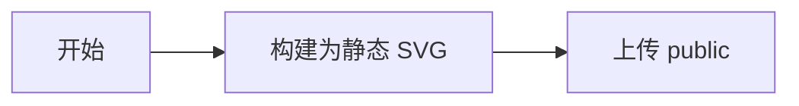

# Quartz 使用教程：把 Obsidian 笔记发布成个人博客

## 一句话理解

Quartz 是一个“Markdown 网页转换器”：你继续使用 Obsidian 写 Markdown，它负责把笔记转换成带目录、搜索、双链和知识图谱的静态网站。

## 一、理论：它是什么

Quartz 不是写作软件，也不是服务器。

它是一个静态网站生成器，负责把 Markdown 文件转换成浏览器可以访问的 HTML、CSS 和 JavaScript 文件。

可以把整个过程理解成：

```text
Obsidian / Markdown 笔记
          ↓
       Quartz 构建
          ↓
    public 静态网页
          ↓
 Caddy、Nginx 或托管平台
          ↓
      用户访问博客
```

Quartz 原生支持 Obsidian 常用能力，包括：

- `[[双向链接]]`
- `![[图片嵌入]]`
- 反向链接
- 文件目录
- 全文搜索
- 标签页面
- 关系图谱
- Callout 提示块
- LaTeX 数学公式
- 代码高亮

因此，它更像一个“可以公开访问的 Obsidian 知识库”，而不是传统的时间线博客。

参考：[Quartz 官方介绍](https://quartz.jzhao.xyz/)

## 二、理论：它是怎么工作的

Quartz 项目里最重要的是下面四部分：

```text
quartz/
├── content/             # 存放公开的 Markdown 笔记
├── quartz.config.yaml   # 网站名称、域名、语言、插件和页面布局
├── quartz.lock.json     # Quartz 5 插件版本锁定文件
└── public/              # 构建后生成的网站文件
```

### 1. `content` 是文章来源

所有准备发布的 Markdown 文件都放在 `content` 目录中。

其中：

```text
content/index.md
```

是网站首页。

例如：

```text
content/
├── index.md
├── Java学习/
│   ├── index.md
│   └── Spring事务.md
└── AI工具/
    └── Codex使用心得.md
```

Quartz 会根据文件夹自动生成栏目，根据 Markdown 文件生成文章页面。

参考：[Quartz 内容说明](https://quartz.jzhao.xyz/authoring-content)

### 2. Quartz 负责转换

执行构建后，Quartz 会读取 Markdown，解析标题、链接、标签和图片，最后生成网页。

### 3. `public` 是最终网站

构建结果默认放在：

```text
public/
```

服务器只需要托管这个目录，不需要让 Quartz 的预览服务一直运行。

### 4. 修改笔记后要重新构建

Markdown 文件不是服务器动态读取的。每次更新文章后，需要重新构建并把新的 `public` 上传到服务器。

## 三、实践：可以拿来干什么

Quartz 适合下面这些场景：

- 发布个人技术笔记
- 建立公开知识库
- 发布项目总结
- 制作学习文档网站
- 展示有关联关系的系列文章
- 将部分 Obsidian 笔记公开

它尤其适合“文章之间存在大量关联”的内容。

例如：

```markdown
学习 Spring 事务前，可以先阅读 [[数据库事务基础]]。

关于远程调用异常，可以参考 [[RPC异常处理]]。
```

访问者点击链接可以在文章之间跳转，Quartz 还会自动显示反向链接和关系图谱。

## 四、最小例子

### 第一步：准备运行环境

Quartz 5 当前要求：

- Node.js 22 或更高版本
- npm 10.9.2 或更高版本
- Git

检查版本：

```bash
node -v
npm -v
git --version
```

版本要求以 [Quartz 官方说明](https://quartz.jzhao.xyz/) 为准。

### 第二步：下载并初始化 Quartz

本次把 Quartz 5 项目放在 `/Volumes/data/develop/quartz`。

#### 1. 下载 Quartz 5

```bash
mkdir -p /Volumes/data/develop
cd /Volumes/data/develop

git clone https://github.com/jackyzha0/quartz.git

cd quartz
```

如果已经存在 `/Volumes/data/develop/quartz`，不要重复执行克隆命令。

#### 2. 安装基础依赖

本机的 npm 全局配置使用了 `npmmirror`。该镜像没有及时同步 Quartz 5 的部分插件，直接执行 `npm install` 时可能出现下面的错误：

```text
404 Not Found
@quartz-community/roam@0.1.0 is not in this registry
```

因此，本次安装直接使用 npm 官方源，并禁止 npm 把锁文件中的官方地址替换回国内镜像：

```bash
npm install \
  --registry=https://registry.npmjs.org/ \
  --replace-registry-host=never \
  --prefer-online
```

三个参数分别表示：

- `--registry`：本次安装使用 npm 官方源。
- `--replace-registry-host=never`：禁止把官方包地址替换成 `npmmirror`。
- `--prefer-online`：优先联网检查，避免继续使用已经缓存的 404 结果。

首次安装需要下载数百个依赖，可能几分钟没有明显输出。只要最终看到类似下面的提示就表示成功：

```text
added 367 packages, and audited 368 packages
```

如果出现 `npm audit` 漏洞提示，先不要执行 `npm audit fix --force`，因为强制升级可能破坏 Quartz 当前锁定的依赖关系。

#### 3. 初始化 Quartz

执行：

```bash
npx quartz create
```

按照本次使用场景依次选择：

1. 模板选择 `Obsidian`，保留 Wikilink、Callout、附件嵌入等 Obsidian 兼容能力。
2. 内容初始化选择 `Empty Quartz`，先创建干净的内容目录。
3. `base URL` 填写 Linux 宝塔服务器的公网 IP，不带 `http://`，也不带结尾 `/`。

初始化完成后会生成：

```text
quartz.config.yaml
```

如果终端显示：

```text
All configured plugins are already installed
You're all set!
```

说明配置和插件均已准备完成。

#### 4. `npx` 是什么

`npx` 可以理解成“找到并运行 Node.js 项目里的工具”。例如：

```bash
npx quartz create
```

可以拆成三部分：

| 部分 | 含义 |
| --- | --- |
| `npx` | 找到并运行工具 |
| `quartz` | 要运行的工具名称 |
| `create` | 让 Quartz 执行初始化操作 |

`npm install` 负责下载安装工具和依赖，`npx` 负责运行已经安装好的工具。如果本地找不到对应工具，`npx` 还可能询问是否临时联网下载，因此不要随意运行来源不明的 `npx` 命令。

#### 5. 插件安装命令是否还需要执行

下面这条命令会读取 `quartz.config.yaml`，安装配置中声明的搜索、目录、知识图谱和代码高亮等插件：

```bash
npx quartz plugin install --from-config
```

其中 `--from-config` 表示“按照当前配置文件安装”。如果 `npx quartz create` 已经提示所有插件均已安装，本次不需要再执行。

只有在以下情况才需要重新执行：

- 从 Git 仓库重新下载了项目。
- 在配置中增加或更换了插件。
- 本地插件文件丢失。

完成初始化后，先按后续步骤把文章放入 `content`，然后在第六步生成并预览网站。

可以把安装过程记成：

> 下载 Quartz → `npm install` 安装基础依赖 → `quartz create` 初始化网站。

不建议一开始就把整个工作笔记目录链接进去，因为其中可能包含不应该公开的信息。

### 第三步：把 `content` 当成 Obsidian 仓库

在 Obsidian 中选择“打开本地仓库”，然后打开：

```text
/Volumes/data/develop/quartz/content
```

以后可以直接使用 Obsidian 编辑网站文章。

如果已有笔记，先把确认可以公开的 Markdown 和相关图片复制到 `content`，不要直接复制整个工作笔记仓库。

### 第四步：编写首页

编辑：

```text
content/index.md
```

示例：

```markdown
---
title: 我的个人知识库
description: 记录 Java、AI 工具和项目实践
---

# 欢迎来到我的个人知识库

这里用于整理我在工作和学习中积累的技术笔记。

## 主要内容

- [[Java笔记]]
- [[AI工具]]
- [[项目总结]]
```

### 第五步：创建第一篇文章

创建文件：

```text
content/Quartz使用心得.md
```

写入：

```markdown
---
title: Quartz 使用心得
description: 使用 Quartz 发布 Obsidian 笔记的过程
date: 2026-08-13
tags:
  - Quartz
  - 个人博客
draft: false
---

# Quartz 使用心得

Quartz 可以把 Markdown 笔记转换成静态网站。

## 双向链接

下一步可以阅读 [[部署Quartz到服务器]]。

## 图片

![[attachments/quartz-home.png]]
```

Frontmatter 是文章开头两组 `---` 中间的配置：

- `title`：文章标题
- `description`：文章摘要
- `date`：发布日期
- `tags`：文章标签
- `draft`：是否为草稿

Quartz 支持普通 Markdown，也支持 Obsidian 的 Wikilink 和嵌入语法。

参考：[Quartz Wikilink 说明](https://quartz.jzhao.xyz/features/wikilinks)

### 第六步：本地预览

在 Quartz 项目目录执行：

```bash
npx quartz build --serve --concurrency=1
```

浏览器打开：

```text
http://localhost:8080
```

修改 Markdown 后，页面会自动重新加载。

停止预览时，在终端按：

```text
Control + C
```

`--serve` 只用于本地预览，不应该直接作为生产服务器运行。

参考：[Quartz 构建说明](https://quartz.jzhao.xyz/build)

### 第七步：修改网站名称和访问地址

打开：

```text
quartz.config.yaml
```

找到 `configuration`，重点修改：

```yaml
configuration:
  pageTitle: 我的个人知识库
  locale: zh-CN
  baseUrl: 服务器公网IP
```

说明：

- `pageTitle`：网站名称
- `locale`：中文界面
- `baseUrl`：服务器公网 IP 或正式域名，不填写 `http://`、`https://` 和结尾 `/`
- 还可以在同一文件中修改字体、颜色和统计工具

本次已经在 `npx quartz create` 初始化过程中填写服务器公网 IP。以后绑定正式域名时，再把这里替换成域名即可。

#### 让右侧目录显示清晰的下级结构

Quartz 的右侧目录根据 Markdown 标题前面的 `#` 数量判断层级：

```markdown
# 文章大标题

## 第一章

### 第一节

#### 第一节下面的步骤
```

对应关系：

| Markdown 标题 | 目录中的位置 |
|---|---|
| `#` | 文章大标题 |
| `##` | 一级目录 |
| `###` | 二级目录 |
| `####` | 三级子目录 |

不要为了让文字变大而随意使用 `#`。例如，“第二步：下载并初始化 Quartz”如果使用 `###`，它下面的“下载 Quartz 5”“安装基础依赖”“初始化 Quartz”就应该使用 `####`。

Quartz 5 的目录插件默认只读取到三级标题。要让 `####` 出现在目录中，在 `quartz.config.yaml` 里找到：

```yaml
- source: "@quartz-community/table-of-contents"
  enabled: true
```

修改为：

```yaml
- source: "@quartz-community/table-of-contents"
  enabled: true
  options:
    maxDepth: 4
    minEntries: 1
    showByDefault: true
    collapseByDefault: false
  order: 50
  layout:
    position: right
    priority: 30
```

其中：

- `maxDepth: 4`：目录收录到 `####`。
- `showByDefault: true`：默认显示目录。
- `collapseByDefault: false`：默认展开目录。

如果默认缩进不明显，可以在 `quartz/styles/custom.scss` 中加入：

```scss
// 隐藏目录中重复出现的文章大标题。
.toc-content.overflow > li.depth-0 {
  display: none;
}

// ## 作为目录最外层。
.toc-content.overflow > li.depth-1 {
  padding-left: 0 !important;
  margin-top: 0.35rem;

  > a {
    font-weight: 650;
    opacity: 0.72;
  }
}

// ### 缩进一级。
.toc-content.overflow > li.depth-2 {
  padding-left: 1.25rem !important;

  > a {
    font-size: 0.94rem;
  }
}

// #### 再缩进一级。
.toc-content.overflow > li.depth-3 {
  padding-left: 2.5rem !important;

  > a {
    font-size: 0.88rem;
  }
}

.toc-content.overflow > li.depth-2,
.toc-content.overflow > li.depth-3 {
  position: relative;
}

.toc-content.overflow > li.depth-2::before,
.toc-content.overflow > li.depth-3::before {
  position: absolute;
  color: var(--gray);
  content: "└";
}

.toc-content.overflow > li.depth-2::before {
  left: 0.25rem;
}

.toc-content.overflow > li.depth-3::before {
  left: 1.5rem;
}
```

修改配置或样式后，需要停止旧预览并重新启动：

```bash
npx quartz build --serve --concurrency=1
```

然后在浏览器中按 `Command + Shift + R` 强制刷新。仅修改文章标题层级时，正在运行的预览通常会自动重新构建。

#### 可选优化：切换 Quartz Themes 外观主题

如果默认页面比较单调，可以使用 [Quartz Themes 主题库](https://github.com/saberzero1/quartz-themes) 中兼容 Quartz 5 的主题。本次以 `github-flavored-markdown` 为例，把网站切换成接近 GitHub README 的简洁样式。

这里有两个名字相近、用途不同的包：

| 包名 | 用途 |
| --- | --- |
| `@quartz-community/github-flavored-markdown` | Markdown 语法插件，负责表格、任务列表和删除线等语法 |
| `@quartz-themes/github-flavored-markdown` | 网页外观主题，负责颜色、字体、间距和组件样式 |

本节要安装的是第二个，也就是 `@quartz-themes` 开头的外观主题。

##### 1. 进入 Quartz 项目

```bash
cd /Volumes/data/develop/quartz
```

##### 2. 安装主题

由于本机 npm 镜像曾出现插件包未同步的问题，继续明确使用 npm 官方源：

```bash
npm i @quartz-themes/github-flavored-markdown \\
  --registry=https://registry.npmjs.org/ \\
  --replace-registry-host=never \\
  --prefer-online
```

安装完成后，`package.json` 和 `package-lock.json` 会记录这个主题依赖。

##### 3. 修改主题配置

打开：

```text
/Volumes/data/develop/quartz/quartz.config.yaml
```

找到当前 Quartz Themes 配置：

```yaml
- source: "@quartz-themes/core"
  enabled: true
  options:
    theme: things
    mode: both
```

只把 `theme: things` 改成 `theme: github-flavored-markdown`：

```yaml
- source: "@quartz-themes/core"
  enabled: true
  options:
    theme: github-flavored-markdown
    mode: both
```

其中：

- `theme`：指定要使用的主题名称。
- `mode: both`：同时准备浅色和深色模式。
- 不需要再增加一条新的 `@quartz-themes/core` 配置，项目里只保留原来的这一条并修改主题名。

原有的 Markdown 语法插件不要删除：

```yaml
- source: "@quartz-community/github-flavored-markdown"
  enabled: true
  order: 40
```

语法插件与外观主题职责不同，可以同时启用。

##### 4. 重新启动本地预览

如果旧的预览还在运行，先在对应终端按 `Control + C` 停止，然后执行：

```bash
npx quartz build --serve --concurrency=1
```

打开 `http://localhost:8080`，再按 `Command + Shift + R` 强制刷新浏览器缓存。

##### 5. 恢复原来的主题

如果新主题不合适，不需要卸载整个 Quartz。把配置改回：

```yaml
theme: things
```

然后重新运行本地预览即可。主题切换不会修改 `content` 中的文章内容。

### 第八步：控制哪些笔记能够公开

Quartz 默认使用 `draft` 控制草稿：

```yaml
draft: true
```

但对于工作笔记，更推荐使用“明确允许才发布”的白名单方式。

在 `quartz.config.yaml` 的 `plugins` 列表中，关闭默认的草稿过滤插件：

```yaml
- source: "@quartz-community/remove-draft"
  enabled: false
```

同时开启白名单发布插件：

```yaml
- source: "@quartz-community/explicit-publish"
  enabled: true
```

此后只有包含下面配置的文章才会生成：

```yaml
---
publish: true
---
```

#### 以后每篇文章怎么标记为公开

最推荐直接使用 Obsidian 的“属性”功能，不要手动输入代码围栏：

1. 打开准备发布的文章。
2. 点击文章顶部的“添加属性”。如果没有看到这个入口，可以打开命令面板，执行“添加文件属性”。
3. 属性名称填写 `publish`。
4. 属性类型选择“复选框”。
5. 勾选这个复选框。

设置完成后，Obsidian 会把属性保存在 Markdown 文件最顶部。切换到源码模式时，应该能看到类似内容：

```yaml
---
title: 文章标题
publish: true
---

# 这里开始才是文章正文
```

如果文章顶部已经存在 `title`、`description`、`tags` 等属性，只需要把 `publish: true` 加进原来的两条 `---` 之间：

```yaml
---
title: VPN 原理与 aTrust 隔离网络实践
description: 记录 VPN 与隔离网络的实践过程
tags:
  - VPN
  - 网络
publish: true
---
```

不要再添加第二组属性，也不要把下面两个代码围栏写进真实文章：

```text
```yaml
```

教程示例中代码框顶部的 `yaml` 标签和上下代码围栏，只用于让示例在网页中带有代码样式。真实 Markdown 文件必须以 `---` 开头；如果把代码围栏一起写入文章，Quartz 会把 `title`、`description` 和 `publish` 当成普通代码显示在网页上。

发布规则：

- `publish: true`：构建并发布该文章。
- `publish: false`：不发布。
- 没有 `publish` 属性：不发布。
- 每篇需要公开的文章都要单独设置一次。

设置后重新执行：

```bash
npx quartz build --serve --concurrency=1
```

正式上传服务器前执行：

```bash
npx quartz build --concurrency=1
```

参考：[ExplicitPublish 文档](https://quartz.jzhao.xyz/plugins/ExplicitPublish)

需要注意：被过滤的是 Markdown 页面，图片、PDF、录音等非 Markdown 文件仍可能被复制到最终网站。因此，最安全的方式仍然是只把允许公开的文件放进 `content`。

参考：[Quartz 私有页面说明](https://quartz.jzhao.xyz/features/private-pages)

### 可选优化：在构建时把 Mermaid 转成静态 SVG

Quartz 默认可以在浏览器中加载 Mermaid 再绘制流程图，但国内网络访问外部 CDN 不稳定时，网页可能一直显示 Mermaid 源代码，甚至打开一大页压缩后的 JavaScript。

更稳定的做法是：在本地执行构建时把 Mermaid 代码直接转换成 SVG，并嵌入最终 HTML。服务器只负责发送静态文件，访客打开网页时不需要再下载 Mermaid。

本项目已经完成下面的配置。

#### 1. 安装一次构建依赖

在 Quartz 项目目录执行：

```bash
npm install rehype-mermaid@3.0.0 playwright \
  --registry=https://registry.npmjs.org/ \
  --replace-registry-host=never \
  --prefer-online

npx playwright install chromium
```

这里安装的 Chromium 只在本地构建网站时使用，不会上传到服务器。服务器最终仍然只需要托管 `public` 静态目录。

如果以后改成直接在 Linux 服务器上构建，首次安装浏览器及系统依赖可以使用：

```bash
npx playwright install --with-deps chromium
```

#### 2. 在 `quartz.ts` 中加入静态 Mermaid 转换器

```ts
import { loadQuartzConfig, loadQuartzLayout } from "./quartz/plugins/loader/config-loader"
import rehypeMermaid from "rehype-mermaid"
import { QuartzTransformerPluginInstance } from "./quartz/plugins/types"

const staticMermaid: QuartzTransformerPluginInstance = {
  name: "StaticMermaid",
  htmlPlugins() {
    return [
      [
        rehypeMermaid,
        {
          strategy: "img-svg",
          colorScheme: "light",
          dark: {
            theme: "dark",
          },
          mermaidConfig: {
            theme: "neutral",
            securityLevel: "loose",
            fontFamily: "Arial, sans-serif",
          },
        },
      ],
    ]
  },
}

const config = await loadQuartzConfig()
config.plugins.transformers.unshift(staticMermaid)

export default config
export const layout = await loadQuartzLayout()
```

`img-svg` 会同时生成适用于浅色和深色主题的静态 SVG。

#### 3. 关闭浏览器端 Mermaid

在 `quartz.config.yaml` 中找到：

```yaml
- source: "@quartz-community/obsidian-flavored-markdown"
```

在它的 `options` 中加入：

```yaml
mermaid: false
```

这样可以避免网页再次从 CDN 加载 Mermaid。构建时的静态转换由 `quartz.ts` 负责，两处配置不要同时启用浏览器端渲染。

#### 4. 重新启动预览

如果旧的本地预览还在运行，先按 `Control + C` 停止，再执行：

```bash
npx quartz build --serve --concurrency=1
```

`--concurrency=1` 可以避免同时启动多个构建浏览器进程。正式生成网站时也建议保留这个参数。

从现在开始，在 Obsidian 中继续正常编写 Mermaid 即可：

`````markdown

`````

写完文章后重新构建，流程图会直接进入生成的 HTML，不需要手工截图或转换。

### 第九步：生成正式网站

停止本地预览后执行：

```bash
npx quartz build --concurrency=1
```

成功后生成：

```text
public/
```

这个目录就是最终需要上传到服务器的网站。

### 第十步：上传到自己的服务器

假设服务器网站目录是：

```text
/var/www/quartz
```

可以从本地上传：

```bash
rsync -av public/ 用户名@服务器地址:/var/www/quartz/
```

第一次上传前，需要在服务器上创建目录并设置正确权限。

### 第十一步：使用 Caddy 提供网站访问

服务器安装 Caddy 后，配置：

```caddy
blog.example.com {
    root * /var/www/quartz

    try_files {path} {path}.html {path}/ =404

    file_server
    encode gzip

    handle_errors {
        rewrite * /{err.status_code}.html
        file_server
    }
}
```

然后重新加载 Caddy：

```bash
sudo systemctl reload caddy
```

还需要完成：

1. 把域名解析到服务器公网 IP。
2. 开放服务器的 80 和 443 端口。
3. 确认 Caddy 可以读取 `/var/www/quartz`。

Quartz 生成的文章链接通常不带 `.html`，所以 Caddy 中的 `try_files` 不能省略。

参考：[Quartz 自托管配置](https://quartz.jzhao.xyz/hosting)

### 日常更新流程

以后发布文章只需要：

```text
在 Obsidian 中写文章
        ↓
确认文章允许公开
        ↓
npx quartz build --concurrency=1
        ↓
上传 public 目录
        ↓
网站完成更新
```

对应命令：

```bash
cd /Volumes/data/develop/quartz
npx quartz build --concurrency=1
rsync -av public/ 用户名@服务器地址:/var/www/quartz/
```

## 五、边界与常见误区

### 误区一：Quartz 会自动读取电脑上的所有笔记

不会。它默认只处理 `content` 目录中的内容。

### 误区二：设置 `draft: true` 后所有附件都会保密

不一定。图片、PDF、录音等非 Markdown 文件仍可能进入构建结果。不要把敏感附件放进公开内容目录。

### 误区三：把 `build --serve` 放到服务器长期运行

不推荐。`--serve` 是本地预览模式。正式环境应该构建 `public`，再交给 Caddy 或 Nginx 托管。

### 误区四：Quartz 是传统的时间线博客主题

Quartz 更偏向知识库和数字花园。它能显示文章日期和标签，但默认视觉结构以目录、链接和知识关系为核心。

### 误区五：修改 Markdown 后服务器会自动更新

不会。修改后必须重新构建并上传。后续可以通过 GitHub Actions 或服务器脚本实现自动发布。

## 六、总结

Quartz 的核心只有三步：

```text
把公开笔记放进 content
        ↓
运行 npx quartz build --concurrency=1
        ↓
把 public 放到服务器
```

一句话记忆：

> Obsidian 负责写笔记，Quartz 负责变成网页，Caddy 负责让别人访问。
