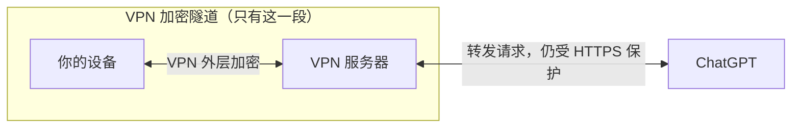
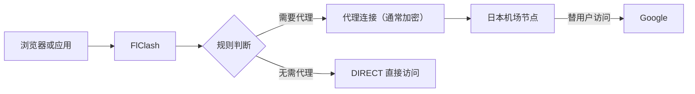
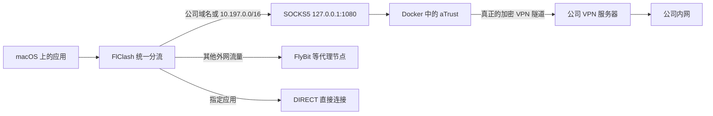
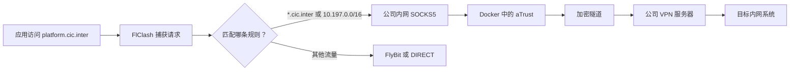

> 关联笔记：[[1.臭名昭著aTrust隔离计划]]

## 1. VPN 到底是什么

VPN（Virtual Private Network，虚拟专用网络）可以理解为：

**先在你的设备和远方的 VPN 服务器之间建立一条“加密隧道”，再让 VPN 服务器替你访问互联网。**

以“在中国使用本地网络无法直接访问 ChatGPT”为例：



图中的紫色边框就是 **VPN 加密隧道的范围**：它从你的设备开始，到 VPN 服务器结束，并不会一直延伸到 ChatGPT。

这里同时存在两层加密：

- **你的设备 ↔ VPN 服务器**：使用 VPN 隧道进行外层加密，VPN 服务器负责拆掉这一层。
- **你的设备 ↔ ChatGPT**：使用 HTTPS 进行端到端加密，贯穿整条访问路线。正常情况下，VPN 服务器只能转发数据，无法解密具体的聊天内容。

原来是你的设备直接尝试连接 ChatGPT；使用 VPN 后，网络路线变成：

```text
你的设备 → VPN 服务器 → ChatGPT
```

VPN 在这个例子中主要做两件事：

1. **改变访问路线**：请求先到能访问 ChatGPT 的 VPN 服务器，再由它继续访问。
2. **改变网络出口**：ChatGPT 看到的来源通常是 VPN 服务器的公网 IP，而不是你本地网络的公网 IP。

## 2. 什么是“加密隧道”

“隧道”不是真有一根专用网线，而是一种网络封装方式：

```text
原始请求：访问 ChatGPT
        ↓ 加密并套上外层地址
外层数据：发送给 VPN 服务器
        ↓ 到达后解密
还原请求：由 VPN 服务器继续访问 ChatGPT
```

可以把它想象成一辆**上锁的快递车**：

- 原始网络数据是车里的货物；这件货物通常还由 HTTPS 单独上锁。
- 互联网负责修路和运送，但看不清车内货物。
- VPN 服务器拥有 VPN 外层的钥匙，负责打开“快递车”并继续转发，但通常打不开 HTTPS 保护的具体内容。

### 加密隧道并不是隐形隧道

在这个例子里，本地网络通常无法直接看清隧道里的原始请求，但仍然能够看到：

- 你的设备连接了哪个 VPN 服务器 IP。
- 使用了哪个端口、连接了多长时间。
- 数据包的大小、频率和流量特征。

所以，加密只能做到**看不清车里的货物**，不能让整辆车消失。如果某个 VPN 服务器或协议被识别，连接仍可能通过以下方式被拦截：

1. **封锁服务器 IP 或端口**：直接阻止设备连接已知的 VPN 节点。
2. **识别协议特征**：根据握手方式、数据包大小和字节分布等特征判断它像不像 VPN 流量。
3. **主动探测服务器**：主动连接可疑服务器，根据其响应判断它是不是代理或 VPN 节点。

公开研究表明，即使流量已经完全加密，仍可能通过流量特征进行识别；OpenVPN 等协议也可能被“被动识别 + 主动探测”。参见 [USENIX 2023：全加密流量的检测与封锁](https://www.usenix.org/conference/usenixsecurity23/presentation/wu-mingshi) 和 [USENIX 2022：OpenVPN 协议指纹](https://www.usenix.org/conference/usenixsecurity22/presentation/xue-diwen)。

之所以不能简单地拦截所有加密连接，是因为 HTTPS、银行、云服务和企业办公也会产生大量正常的加密流量；全部拦截会造成严重误伤。因此现实中通常是选择性识别和封锁。

不过，加密隧道只覆盖 **你的设备到 VPN 服务器** 这一段。VPN 服务器到 ChatGPT 的后半段，仍然需要依靠 HTTPS 等协议保护。

## 3. VPN 服务器做什么

VPN 服务器是加密隧道的另一端，也是你的网络出口。可以把它理解成一个位于远方的“网络中转站”。它通常负责：

- 验证你的 VPN 账号或密钥。
- 与 VPN 客户端协商密钥并建立加密连接。
- 解密隧道中的请求，读取你要访问的目标地址。
- 代替你的设备连接 ChatGPT。
- 把 ChatGPT 的响应重新送入加密隧道，传回你的设备。

例如你连接的是新加坡 VPN 服务器，访问路线就是：

```text
中国本地网络 → 新加坡 VPN 服务器 → ChatGPT
```

此时，ChatGPT 通常看到的是新加坡 VPN 服务器的公网 IP。你的真实网络并没有“搬到新加坡”，只是互联网请求改为从新加坡服务器中转出去。

VPN 服务器处在通信中间，因此服务商是否可信很重要。另外，VPN 只负责改变连接路线和网络出口，并不能保证账号一定可用；目标网站仍可能根据账号、出口 IP、服务地区和风控规则决定是否提供服务。

## 4. 普通机场是怎么工作的

“机场”是代理服务商的俗称。机场通常提供订阅链接和多台代理服务器，这些服务器一般叫作“节点”。

几个常见概念的关系是：

- **机场**：提供整套代理服务的服务商。
- **节点**：真正替你访问目标网站的代理服务器。
- **订阅链接**：保存节点地址、端口、认证信息和协议等配置的清单，本身不传输流量。
- **FlClash**：读取订阅、接管请求并按规则选择节点的本地客户端。

### Shadowsocks、Trojan、VLESS 和 TLS 是什么

先记住最重要的区别：

> **Shadowsocks、Trojan、VLESS 是代理协议，负责规定 FlClash 怎样把请求交给机场节点；TLS 是通用的安全协议，负责给一段连接加密、验明服务器身份并防止数据被篡改。**

可以把访问请求想象成一个快递包裹：

| 名称 | 大白话理解 | 加密由谁负责 |
|---|---|---|
| **Shadowsocks** | 一套“带密码的快递规则”：客户端按约定加密并打包，节点解密后代为转发 | Shadowsocks 自己使用约定的加密算法保护代理数据 |
| **Trojan** | 把代理请求装进一条真正的 TLS 连接中，外部看起来更接近普通的加密网站连接 | 主要由 TLS 负责 |
| **VLESS** | 一张轻量的“快递单”：说明用户身份、目标地址和数据怎样转发，本身不负责把内容加密 | 通常搭配 TLS 或其他安全传输方式 |
| **TLS** | 通用的“防拆安全箱”，HTTPS 中的 `S` 主要就来自它；它不是机场节点，也不负责选择访问路线 | TLS 自己负责加密、完整性保护和服务器身份验证 |

它们之间不是四选一的同类关系。更准确地说：

```text
Shadowsocks = 代理规则 + 自带加密
Trojan      = Trojan 代理规则 + TLS
VLESS       = VLESS 代理规则 + TLS 等安全传输方式
TLS         = 可被不同上层协议使用的通用安全外壳
```

例如订阅中写着 `VLESS + TLS`，意思不是同时使用两个代理，而是：**VLESS 负责组织和转发代理请求，TLS 负责把 FlClash 到机场节点的这段连接保护起来。**

相关规范：[Shadowsocks 官方说明](https://shadowsocks.org/doc/what-is-shadowsocks.html)、[Trojan 协议说明](https://trojan-gfw.github.io/trojan/protocol.html)、[VLESS 协议说明](https://xtls.github.io/en/development/protocols/vless.html)、[TLS 1.3 标准](https://www.rfc-editor.org/info/rfc9846/)。

以通过日本节点访问 Google 为例：



完整过程是：

1. 应用发出访问 Google 的请求。
2. FlClash 捕获请求，根据规则决定使用哪个机场节点。
3. FlClash 通过 Shadowsocks、Trojan、VLESS 等代理协议，把请求发送给节点。
4. 节点取出目标地址，代替用户连接 Google。
5. Google 把结果返回给节点，节点再把数据送回 FlClash 和应用。

这时，网站通常看到的是**机场节点的公网 IP**，而不是用户本地网络的公网 IP。运营商主要能看到用户正在连接某个节点；节点则能知道请求要去往哪个目标地址。

需要注意，这里可能同时存在两层保护：

- **FlClash 到机场节点**：通常由代理协议和 TLS 等方式保护，是否加密以及如何加密取决于具体节点配置。
- **应用到 HTTPS 网站**：由 HTTPS 提供端到端内容加密。

代理不天然等于加密，因此可信节点仍然很重要。节点掌握连接目标、时间和流量等信息；访问未使用 HTTPS 的网站时，它还可能看到明文内容。

### 机场代理和公司 VPN 的区别

两者都包含“先连接远端服务器，再由服务器转发”的过程，但目的不同：

| 对比 | 普通机场 | 公司 VPN |
|---|---|---|
| 远端服务器 | 机场节点 | 公司 VPN 服务器 |
| 主要目的 | 通过其他网络出口访问互联网 | 安全进入公司专用网络 |
| 常见目标 | 普通互联网网站 | 公司域名和内网 IP |
| 当前实践 | FlyBit 等代理节点 | Docker 中的 aTrust |

FlClash 开启 Tun 模式后，从应用视角看很像 VPN：它通过虚拟网卡接管更多系统流量。但在这套实践里，FlClash 的核心职责仍是**代理和分流**，真正进入公司内网的 VPN 隧道由 aTrust 建立。

## 5. aTrust 放进 Docker 后发生了什么

原来 aTrust 直接运行在 macOS 上，会创建虚拟网卡并修改宿主机路由，容易和 FlClash 的 Tun 模式争夺流量控制权。

把 aTrust 放进 Docker 后，**真正的公司 VPN 隧道只存在于容器内部**。容器再通过 `127.0.0.1:1080` 暴露一个 SOCKS5 代理入口，供宿主机使用。

### SOCKS5 是什么

SOCKS5 是一种**通用的网络转发协议**，可以把它理解成一个“网络转发窗口”。

客户端连接 SOCKS5 服务后，会先告诉它：

> 请帮我连接这个目标地址和端口，后面的数据都由你代为转发。

SOCKS5 服务收到要求后，会替客户端连接目标服务器，然后在双方之间来回搬运数据。它可以处理 TCP，也定义了 UDP 转发方式，并支持 IPv4、IPv6 和域名形式的目标地址。

需要注意：**SOCKS5 本身通常不负责加密。**它主要规定怎样提交目标地址、建立连接和转发数据。是否加密，要看外面是否还有 TLS、VPN 或其他安全协议保护。

SOCKS5 和 Shadowsocks 也不是同一种协议：

| 对比 | SOCKS5 | Shadowsocks |
|---|---|---|
| 核心作用 | 通用地转交目标地址并转发数据 | 把代理请求加密后发送给远端节点 |
| 默认加密 | 通常没有 | 有自己的加密方式 |
| 当前实践中的位置 | FlClash 到 Docker aTrust 的本机交接 | 常用于 FlClash 到机场节点的远程连接 |

在当前方案中，FlClash 把公司请求交给 `127.0.0.1:1080`，SOCKS5 再从容器内部替它连接目标。这个过程只是**宿主机与容器的交接**，真正通往公司的加密隧道仍由 aTrust 建立。

测试命令中的 `socks5h://127.0.0.1:1080` 多了一个 `h`，表示**域名也交给 SOCKS5 服务所在的一侧解析**，适合只有公司网络才能解析的内部域名。

一句话记忆：**SOCKS5 是转交请求的窗口，aTrust 才是建立公司加密隧道的人。**

相关规范：[RFC 1928：SOCKS Protocol Version 5](https://www.rfc-editor.org/info/rfc1928/)。



这里有两个容易混淆的连接：

| 连接 | 作用 | 是不是公司 VPN 隧道 |
|---|---|---|
| FlClash → `127.0.0.1:1080` → Docker | 把公司请求交给容器 | 不是，只是本机 SOCKS5 转发 |
| Docker 中的 aTrust → 公司 VPN 服务器 | 加密传输并进入公司网络 | 是 |

## 6. 这套实践中的完整流程

以访问 `platform.cic.inter` 为例：



各组件的分工是：

- **FlClash 是交通指挥员**：识别请求该走公司内网、外部代理还是直连。
- **SOCKS5 是交接窗口**：把宿主机选中的公司请求送进 aTrust 容器。
- **aTrust 是 VPN 客户端**：在容器里完成登录、加密和隧道建立。
- **公司 VPN 服务器是远端网关**：解密请求并转发到公司内网。
- **Docker 是隔离房间**：把 aTrust 的虚拟网卡和路由变化限制在容器网络中，减少对 macOS 路由的影响。

因此，FlClash 开启 Tun 模式时可以统一接管应用流量，但不再与宿主机上的 aTrust 抢虚拟网卡；公司请求被转交给容器，其余请求继续按 FlClash 规则处理。

## 7. 一句话总结

**机场节点是访问互联网的“网络代办员”，公司 VPN 服务器是进入公司内网的专用入口；你的方案让 FlClash 统一分流，把普通外网交给机场，把公司流量通过 SOCKS5 交给 Docker 中的 aTrust。**

> 注意：Docker 隔离主要解决宿主机路由冲突，不等于绝对安全隔离；aTrust 容器使用 `privileged` 和 `/dev/net/tun` 时，在容器内部仍拥有较高权限。
