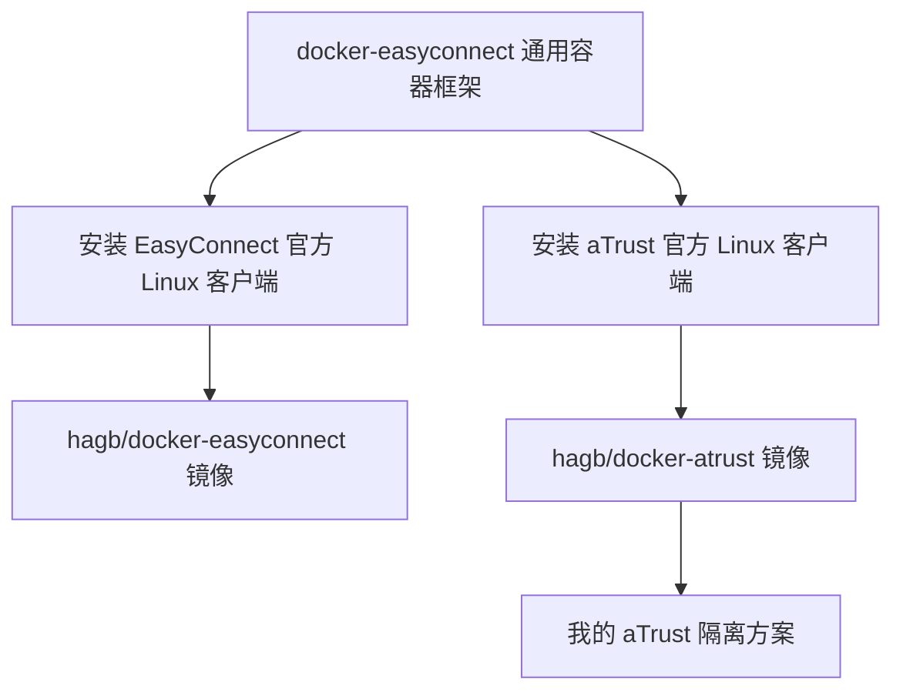
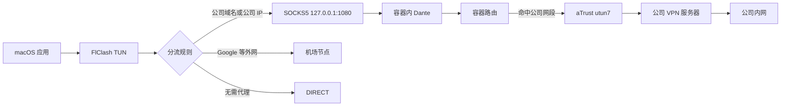

# docker-easyconnect 到底做了什么

> 关联笔记：[[1.臭名昭著aTrust隔离计划]]、[[2.VPN原理与aTrust隔离网络实践]]、[[4.TUN（tunnel-隧道-虚拟网卡）模式]]  
> 项目地址：[docker-easyconnect/docker-easyconnect](https://github.com/docker-easyconnect/docker-easyconnect)

## 一句话理解

`docker-easyconnect` **不是重新实现了一套 VPN，也不是用 SOCKS5 替代 aTrust**。它做的是“封装和转接”：根据所选镜像，分别把深信服官方的 EasyConnect Linux 客户端或官方 aTrust Linux 客户端装进 Docker。EasyConnect 和 aTrust 是两个独立客户端，不是谁具备了谁的能力；它们只是复用了同一套容器运行、图形操作和代理转接框架。

在我的方案中，实际运行的是该项目提供的 `hagb/docker-atrust` 镜像，而不是 EasyConnect 镜像。

## 一、理论：它是什么

### 1. 它是一个“容器化适配层”

这个项目处在 Docker 与 aTrust 之间，主要解决三个问题：

1. **让 aTrust 能在容器里启动**：准备 Debian、图形库、系统工具和 aTrust 依赖。
2. **让 aTrust 能在容器里建立 VPN**：给容器使用 `/dev/net/tun` 的能力，并允许它管理容器内部网络。
3. **让宿主机能使用容器里的 VPN**：启动 SOCKS5 和 HTTP 代理，把容器端口映射到宿主机。

它没有替代 aTrust 的登录、认证、加密和 VPN 协议。真正连接公司 VPN 服务器的仍然是 aTrust 官方客户端。

### 2. 项目名容易造成的误解

仓库叫 `docker-easyconnect`，但它同时支持 EasyConnect 和 aTrust：

| 使用对象 | 镜像示例 | 容器内 VPN 网卡名 |
|---|---|---|
| EasyConnect | `hagb/docker-easyconnect` | `tun0` |
| aTrust | `hagb/docker-atrust` | `utun7` |

我的隔离计划用的是第二种。因此后文说的“这个项目”，指的是它对 aTrust 的容器化封装能力，并不是说我在容器里运行了 EasyConnect 客户端。

### 3. EasyConnect、aTrust 与 docker-easyconnect 的真实关系

**aTrust 并不是在 EasyConnect 的基础上获得了某种能力，也不是 EasyConnect 中包含 aTrust。**从这个项目可以确认的是：

- EasyConnect 和 aTrust 都是深信服提供的客户端；
- 项目分别使用 EasyConnect 官方 Linux 版安装包和 aTrust 官方 Linux 版安装包；
- 构建镜像时，项目根据目标类型安装其中一个客户端；
- 两种镜像共用 Debian、TUN、VNC、SOCKS5、HTTP 代理和启动脚本等外围设施。



项目代码也给两套客户端配置了不同的程序、进程和虚拟网卡：

| 对比项 | EasyConnect | aTrust |
|---|---|---|
| 主要程序 | `EasyConnect`、`ECAgent` | `aTrustTray`、`aTrustAgent` |
| 默认 VPN 虚拟网卡 | `tun0` | `utun7` |
| 镜像 | `hagb/docker-easyconnect` | `hagb/docker-atrust` |

项目名称保留 `docker-easyconnect`，容易让人误以为 aTrust 是 EasyConnect 的一种模式。实际应当理解为：**同一个开源项目维护了两套镜像，我使用的 `hagb/docker-atrust` 只装载并运行 aTrust。**

可以用一个简单类比记忆：EasyConnect 和 aTrust 是两位不同的乘客，docker-easyconnect 是一套公共运输系统；我的车里坐的是 aTrust，不是 EasyConnect。

### 4. 各组件的职责

| 组件                    | 实际职责                       | 不负责什么               |
| --------------------- | -------------------------- | ------------------- |
| Docker/OrbStack       | 提供独立的 Linux 进程、网卡和路由环境     | 不会替我登录公司 VPN        |
| docker-easyconnect 项目 | 制作镜像、启动相关服务、处理容器内路由并提供代理入口 | 不实现公司 VPN 协议        |
| aTrust                | 登录、认证、建立加密 VPN 隧道、写入公司内网路由 | 不决定 macOS 上哪些应用应该走它 |
| Dante                 | 在 `1080` 端口提供 SOCKS5 代理    | SOCKS5 本身不负责 VPN 加密 |
| Tinyproxy             | 在 `8888` 端口提供 HTTP 代理      | 不替代 SOCKS5，也不建立 VPN |
| TigerVNC              | 把容器内的 aTrust 图形界面显示给宿主机    | 只负责操作界面，不传输业务请求     |
| FlClash               | 接管 macOS 流量并按规则分流          | 不负责建立公司 VPN 隧道      |

## 二、理论：它是怎么工作的

### 1. 构建镜像：给 aTrust 准备一间能住的 Linux 房间

项目以精简 Debian 镜像为基础，安装 aTrust 运行所需的图形库和网络工具。镜像中还加入了：

- `dante-server`：提供 SOCKS5 代理；
- `tinyproxy`：提供 HTTP 代理；
- `tigervnc`、轻量窗口管理器：显示和操作 aTrust 登录界面；
- `iptables`、`iproute2`：处理容器内部的 NAT、策略路由和端口访问；
- `socat`：转接 aTrust 与浏览器通信所需的本地端口；
- 启动、重连、配置持久化等辅助脚本。

项目使用的是深信服的非自由软件包，项目自身并不是深信服官方项目。可以把它理解为：**官方 aTrust 客户端仍是发动机，docker-easyconnect 负责造车架、仪表盘和对外接口。**

### 2. 启动容器：把 TUN 和网络管理权限交给容器

aTrust 建立 VPN 时需要创建虚拟网卡、写路由并配置网络，因此项目文档要求容器至少具备：

```yaml
devices:
  - /dev/net/tun
cap_add:
  - NET_ADMIN
```

两项配置的含义分别是：

- `/dev/net/tun`：允许容器创建 TUN 虚拟网卡；
- `NET_ADMIN`：允许容器修改自己的网卡、路由和防火墙规则。

我当前的 Compose 还启用了：

```yaml
privileged: true
```

这是为了解决当前 OrbStack 环境中的路由报错和连接不稳定，并不是项目对所有环境的通用最低要求。`privileged` 会给容器更广的权限，开启后再写 `NET_ADMIN` 实际上属于显式保留和说明，权限能力本身已经包含在 `privileged` 中。

最关键的隔离效果是：aTrust 修改的是**容器所在 Linux 环境的网络**，而不是直接把自己的 TUN 和路由装到 macOS 网络栈中。

### 3. 启动配套服务：先准备操作窗口和代理窗口

项目的启动脚本会准备多个服务：

| 容器端口 | 服务 | 用途 |
|---|---|---|
| `5901` | TigerVNC | 查看并操作 aTrust 图形界面 |
| `1080` | Dante SOCKS5 | 让宿主机通过容器发起连接 |
| `8888` | Tinyproxy HTTP | HTTP 代理备用入口 |
| `54631` | aTrust 本地 Web 通信 | 某些 Web 登录流程使用，当前 VNC 登录方案可以不映射 |

启动 SOCKS5 时，项目会根据 aTrust 使用的接口名 `utun7` 生成 Dante 配置。为了让 Dante 在 aTrust 尚未完成登录时也能先启动，脚本会临时创建同名 TUN 接口，启动 Dante 后再删除；真正登录成功后，aTrust 再创建和管理自己的 VPN 接口。

这段“胶水逻辑”正是项目的重要价值之一：它协调了一个原本假定自己运行在完整桌面系统里的闭源 VPN 客户端，以及 Docker 这种容器运行环境。

### 4. 登录 aTrust：真正的 VPN 隧道在这一步才出现

容器启动成功不等于公司 VPN 已经连接。启动后的状态只是：

- aTrust 相关进程已经能在容器中运行；
- VNC 操作入口已经准备好；
- SOCKS5 和 HTTP 代理端口已经监听。

通过 VNC 输入公司 VPN 地址、账号和认证信息后，才由 aTrust 完成：

1. 与公司 VPN 服务器通信；
2. 完成身份认证；
3. 建立加密隧道；
4. 创建或接管容器内的 `utun7`；
5. 把公司网段、内部 DNS 等网络规则写入容器环境。

所以，`1080` 端口能连接，只能证明 SOCKS5 服务活着；通过它能访问公司内网，才能证明 aTrust 隧道和容器路由已经真正可用。

### 5. 代理转接：把“容器能访问内网”变成“宿主机也能借用”

当宿主机访问 `127.0.0.1:1080` 时，流程不是把原始 IP 数据包直接塞给 aTrust，而是：

1. 客户端连接容器里的 Dante；
2. 客户端告诉 Dante 想访问的目标地址和端口；
3. Dante 在容器内部重新建立一条到目标的连接；
4. 这条连接遵守容器当前路由；
5. 如果目标属于 aTrust 下发的公司网段，就经 `utun7` 进入公司 VPN；
6. Dante 在宿主机客户端和目标服务之间转发数据。

这里有一个容易忽略的事实：**Dante 并不是把所有请求强制塞进 aTrust。**它只是从容器内部代为建立连接，最终走 `utun7` 还是容器原来的默认网络，由容器路由和 aTrust 下发策略决定。

因此，FlClash 仍然必须正确分流。不能因为存在 `1080` 端口，就认为任何请求交给它都会自动、安全地走公司 VPN。

### 6. 自动重连与数据持久化

项目启动脚本会监控 aTrust 前端和相关进程。前端退出后，默认会清理残留进程并重新启动。我的 Compose 又设置了：

```yaml
restart: unless-stopped
```

两层机制解决的是不同问题：

- 项目脚本负责容器内部的 aTrust 进程重启；
- Docker 重启策略负责整个容器异常退出或机器重启后的恢复。

`./data:/root` 则把容器内 `/root` 挂载到宿主机，用来保存 aTrust 配置、登录状态和 VNC 相关数据。容器重建后，这些数据仍然存在。

## 三、实践：它在“臭名昭著 aTrust 隔离计划”中干了什么

### 1. 原来的冲突

aTrust 和 FlClash TUN 都运行在 macOS 时，两者都可能：

- 创建虚拟网卡；
- 改写路由；
- 接管 DNS 或网络流量；
- 长期保留后台进程。

问题的本质不是它们都叫“代理”或“VPN”，而是两套网络控制逻辑同时争夺宿主机流量入口。

### 2. 隔离后的职责重新分配

容器化之后：

- macOS 上只让 FlClash TUN 统一接管和分类流量；
- 公司请求交给 `127.0.0.1:1080`；
- Dante 在容器中替宿主机发起连接；
- aTrust 只修改容器内部网络并负责进入公司内网；
- 普通外网继续走机场节点或直连。



### 3. docker-easyconnect 带来的核心变化

变化前，aTrust 给 macOS 提供的是一整套“系统级 VPN 网络环境”。

变化后，docker-easyconnect 把它压缩成了一个更容易控制的接口：

```text
macOS 看到的 aTrust 能力 ≈ 一个本机 SOCKS5 地址 127.0.0.1:1080
```

这不是说 aTrust 变成了 SOCKS5，而是说 **aTrust 的复杂副作用被留在容器里，宿主机只消费它导出的代理能力。**

### 4. 三条链路不要混为一谈

| 链路 | 作用 | 是否加密 | 由谁负责 |
|---|---|---|---|
| VNC → `5901` | 操作容器里的 aTrust 界面 | 取决于 VNC 部署方式，本机端口映射不是公司 VPN | TigerVNC |
| FlClash → SOCKS5 `1080` | 把选中的请求交给容器 | SOCKS5 本身不提供 VPN 加密 | Dante |
| aTrust → 公司 VPN 服务器 | 建立公司 VPN 隧道 | 是，具体协议由 aTrust 和公司服务端决定 | aTrust |

## 四、最小例子

### 1. 更安全的 Compose 关键部分

结合我的现有配置，建议至少把宿主机端口限制为只监听本机：

```yaml
services:
  atrust:
    image: hagb/docker-atrust:latest
    container_name: atrust
    privileged: true
    restart: unless-stopped

    devices:
      - /dev/net/tun
    cap_add:
      - NET_ADMIN

    ports:
      - "127.0.0.1:1080:1080" # SOCKS5，仅供本机 FlClash 使用
      - "127.0.0.1:5901:5901" # VNC，仅供本机登录使用
      - "127.0.0.1:8888:8888" # HTTP 代理备用

    environment:
      - PASSWORD=请改成单独保存的强密码
      - URLWIN=1

    volumes:
      - ./data:/root

    sysctls:
      - net.ipv4.conf.default.route_localnet=1
```

我原配置中的 `"1080:1080"`、`"5901:5901"` 会绑定宿主机的所有网络接口。只要系统防火墙和所在网络允许，局域网其他设备就可能访问这些端口。改成 `127.0.0.1:宿主机端口:容器端口` 后，入口只提供给当前 Mac。

### 2. 最小验证

登录 aTrust 后，可以通过 SOCKS5 测试公司内网：

```bash
curl --max-time 10 \
  --proxy socks5h://127.0.0.1:1080 \
  http://platform.cic.inter/
```

这里的输入、过程和结果分别是：

- **输入**：目标域名 `platform.cic.inter`；
- **过程**：`curl` 把域名和请求交给容器内 SOCKS5，容器再通过自己的 DNS、路由和 aTrust 隧道访问；
- **结果**：能获得内网页面响应，说明“SOCKS5 → 容器路由 → aTrust VPN → 公司内网”整条链路可用。

`socks5h` 中的 `h` 表示域名也交给代理侧解析，适合只有公司网络才能解析的内部域名。

### 3. 从一个请求看完整过程

以访问 `platform.cic.inter` 为例：

1. 应用发起访问；
2. FlClash TUN 捕获请求；
3. 规则识别出公司域名；
4. FlClash 连接 `127.0.0.1:1080`；
5. Docker 端口映射把连接送到容器的 Dante；
6. Dante 在容器内请求解析并连接目标；
7. 容器路由发现目标属于公司网络；
8. 数据经 aTrust 的 `utun7` 进入 VPN；
9. 公司 VPN 服务器将请求转发到内网系统；
10. 响应沿原路返回应用。

## 五、边界与常见误区

### 误区一：docker-easyconnect 自己实现了 VPN

没有。它运行、协调并包装深信服客户端。登录、认证和加密隧道仍由 aTrust 完成。

### 误区二：SOCKS5 就是公司 VPN 隧道

不是。SOCKS5 是宿主机与容器之间的请求转接协议。公司 VPN 隧道存在于 aTrust 与公司 VPN 服务器之间。

### 误区三：端口 `1080` 已监听，就说明公司 VPN 正常

不一定。Dante 可以先于 aTrust 登录启动。必须通过该代理成功访问公司资源，才能证明完整链路正常。

### 误区四：进入 SOCKS5 的所有流量都会走公司 VPN

不一定。Dante 从容器内部建立连接，具体走公司隧道还是容器默认网络取决于目标地址、aTrust 下发路由和容器路由表。FlClash 的规则仍然是方案的关键部分。

### 误区五：放进 Docker 就等于绝对安全隔离

不是。Docker 隔离首先解决的是进程、网卡和路由影响范围问题，不是强安全沙箱。当前配置还启用了 `privileged`，容器内部权限很高；实际隔离强度还受挂载目录、端口映射、容器运行时和宿主机防护影响。

在 macOS 上，Docker/OrbStack 通常还隔着一层 Linux 虚拟化环境，这有助于减少 aTrust 直接修改 macOS 网络栈的机会，但仍不应把它描述成经过验证的绝对安全边界。

### 误区六：默认端口映射只允许本机访问

不是。`"1080:1080"` 通常会监听所有宿主机接口；`"127.0.0.1:1080:1080"` 才明确限定为本机。项目文档也不建议把无保护的 SOCKS5、HTTP 代理直接对外开放。

VNC 同样应该只监听本机，并设置强密码。项目生成的 SOCKS5 默认没有账号密码；如果必须对其他设备开放，应先评估网络边界，并使用项目提供的 `SOCKS_USER`、`SOCKS_PASSWD` 等认证配置，但最稳妥的做法仍是不对外开放。

### 误区七：可以把镜像装到公网服务器供多人使用

技术上可以映射端口，但不代表应该这样做：

- 会把 VNC、SOCKS5 或 HTTP 代理暴露到公网；
- 可能泄露 aTrust 登录状态、公司访问能力和持久化数据；
- 多人会共享同一条公司 VPN 会话和审计身份；
- 可能违反公司安全制度、账号规则或软件授权要求；
- 公网服务器是否能登录，还取决于公司 VPN 服务端的设备校验、来源限制和认证策略。

这套方案的目标是**本机隔离和本机分流**，不是把公司 VPN 改造成公共代理服务。

### 误区八：挂载 `./data:/root` 只是保存普通配置

其中可能包含登录状态、配置和客户端生成的数据，应当按敏感文件对待：

- 不提交到 Git；
- 不同步到公共网盘；
- 限制本机其他用户读取；
- 排查问题时不要随意把整个目录打包发给别人。

### 误区九：容器化可以绕过公司安全策略

不能。公司 VPN 服务端仍然控制认证、授权、可访问网段和审计策略。这个方案只改变客户端运行位置和宿主机流量组织方式，不会自动绕过服务端控制，也不应被用于规避公司的合法安全要求。

## 六、扩展：其他 VPN 能否复用这套方案

### 1. 通用的是架构，不是当前镜像

“把 VPN 装进容器，再把容器的联网能力提供给宿主机”是一种通用架构，并不只适用于 EasyConnect 和 aTrust。只要另一个 VPN 满足下面几个条件，理论上也可以采用相同思路：

1. 提供能在 Linux 中运行的客户端，或者提供标准 OpenVPN、WireGuard 配置；
2. 能在容器中创建虚拟网卡并修改容器路由；
3. 登录和认证流程能在容器环境中完成；
4. 容器中能够同时运行 SOCKS5、HTTP 代理，或者被配置成网络网关；
5. VPN 自身的设备检测和安全策略没有禁止容器环境。

通用架构可以概括为：

```text
宿主机应用
   ↓
FlClash 分流
   ↓
宿主机本地 SOCKS5 端口
   ↓
容器内代理服务
   ↓
容器内 VPN 客户端
   ↓
VPN 服务器
```

`hagb/docker-atrust` 却不是通用 VPN 镜像。它的脚本认识的是 EasyConnect/aTrust 的安装目录、进程、登录端口和网卡名，不能把配置里的名字改成 NordVPN 就直接使用。

### 2. 以 NordVPN 为例

NordVPN 具备 Linux 客户端，官方也提供了在 Docker 中构建并运行 NordVPN 客户端的方法。它的 Linux 客户端会管理虚拟网卡、防火墙、路由和 DNS，因此可以把这些网络变化限制在容器环境中。

但 NordVPN 官方特别说明：**只把 NordVPN 放进容器，默认只会让该容器内部产生的流量走 VPN，不会自动让 macOS 宿主机使用这条 VPN。**

如果只想让某个 Docker 应用走 NordVPN，可以让该应用与 NordVPN 容器共享网络环境。如果想像当前 aTrust 方案一样，让 macOS 上的 FlClash 有选择地使用 NordVPN，还需要再加入 Dante 等代理服务，并把 SOCKS5 端口映射到宿主机：


也可以不安装 NordVPN 原生客户端，改用 NordVPN 官方提供的 OpenVPN 配置文件，在容器里运行标准 OpenVPN 客户端，再配合 Dante 导出 SOCKS5。两种方案的容器实现不同，但“VPN 隔离 + 代理出口”的总体结构相同。

### 3. NordVPN 与 aTrust 方案的用途差异

| 对比项 | aTrust 容器 | NordVPN 容器 |
|---|---|---|
| 远端入口 | 公司 VPN 服务器 | NordVPN 公网服务器 |
| 主要用途 | 访问获得授权的公司内网 | 更换公网出口、让指定公网流量经过 NordVPN |
| 宿主机如何使用 | 当前镜像已经提供 SOCKS5 `1080` | 需要额外配置 SOCKS5、HTTP 代理或网关 |
| 能否访问公司内网 | 由公司 VPN 授权和路由决定 | 通常不能，NordVPN 不会获得公司内网路由 |
| 能否复用当前镜像 | 正在使用 `hagb/docker-atrust` | 不能，需要单独的 NordVPN 镜像和启动逻辑 |

所以，NordVPN 可以获得的是**相同的容器隔离和代理转接形式**，而不是 aTrust 的公司内网访问能力。最终能访问哪里，仍由所连接的 VPN 服务器决定。

### 4. 一句话总结

> **“VPN 装进容器，再导出 SOCKS5 给 FlClash”是一套通用架构；docker-easyconnect 只是专门替 EasyConnect/aTrust 做好了这层封装，NordVPN 等其他 VPN 需要各自的容器镜像和适配。**

## 七、总结

`docker-easyconnect` 实际完成了四件事：

1. **装得下**：为官方 aTrust Linux 客户端准备依赖和图形运行环境；
2. **跑得起**：提供 TUN、网络权限、启动顺序、重连和持久化处理；
3. **操作得了**：通过 VNC 或 Web 登录入口操作容器内 aTrust；
4. **接得出来**：通过 SOCKS5、HTTP 代理或网关方式，把容器的网络能力交给宿主机。

放进我的“臭名昭著 aTrust 隔离计划”里，一句话可以复述为：

> **docker-easyconnect 把原本会直接碰 macOS 网卡和路由的 aTrust，关进了容器；aTrust 仍负责打通公司 VPN，Dante 再把这份内网访问能力变成 `127.0.0.1:1080`，最后由 FlClash 决定哪些请求可以使用它。**

## 参考资料

- [docker-easyconnect 项目说明](https://github.com/docker-easyconnect/docker-easyconnect)
- [项目使用说明：权限、代理、VNC、持久化与 Web 登录](https://github.com/docker-easyconnect/docker-easyconnect/blob/master/doc/usage.md)
- [Dockerfile：镜像基础环境和依赖](https://github.com/docker-easyconnect/docker-easyconnect/blob/master/Dockerfile)
- [start.sh：Dante、Tinyproxy、VNC、iptables 和保活逻辑](https://github.com/docker-easyconnect/docker-easyconnect/blob/master/docker-root/usr/local/bin/start.sh)
- [vpn-config.sh：EasyConnect 与 aTrust 的进程、接口和启动差异](https://github.com/docker-easyconnect/docker-easyconnect/blob/master/docker-root/usr/local/bin/vpn-config.sh)
- [NordVPN 官方 Docker 构建说明](https://support.nordvpn.com/hc/en-us/articles/20465811527057-How-to-build-the-NordVPN-Docker-image)
- [NordVPN 官方 Linux 客户端源码](https://github.com/NordSecurity/nordvpn-linux)
- [NordVPN 官方 Linux OpenVPN 手动连接说明](https://support.nordvpn.com/hc/en-us/articles/20164827795345-How-to-set-up-a-manual-connection-on-Linux-using-OpenVPN)
