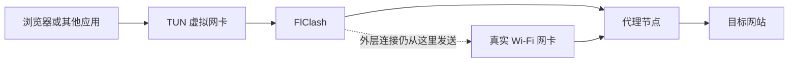
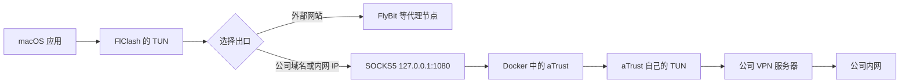

# TUN 模式

> 关联笔记：[[2.VPN原理与aTrust隔离网络实践]]、[[1.臭名昭著aTrust隔离计划]]

## 一句话理解

**全局模式决定“已经进入 FlClash 的流量往哪里走”，TUN 模式负责“尽可能把设备的 IP 流量带进 FlClash”。**

在公司网络管控环境下，不开启 TUN 时，浏览器的部分流量或 DNS 查询可能绕过系统代理直接进入公司网络，随后被拦截；开启 TUN 后，这些流量先进入虚拟网卡，再由 FlClash 通过代理节点转发，所以原本无法访问的网站可能恢复正常。

## 一、理论：它是什么

理解 TUN 之前，需要先认识网卡、虚拟网卡、IP 数据包和网络层。它们其实是在描述同一件事：**浏览器的数据离开电脑之前，要经过哪些步骤、从哪个出口发送。**

### 1. 什么是网卡

浏览器访问网站时，数据需要通过一个出口离开电脑。这个出口叫作**网卡**。

Mac 连接 Wi-Fi 时，过程可以简化为：

```text
浏览器的数据
  ↓
Mac 的 Wi-Fi 网卡
  ↓
无线路由器
  ↓
互联网
```

Wi-Fi 网卡是真实存在的硬件，它负责把电脑里的数据变成无线信号并发送给路由器。如果使用网线，那么负责发送数据的就是有线网卡，也就是与网线连接的硬件。

这类真正负责把数据送出电脑的设备，可以统称为**真实网卡**。

### 2. 什么是虚拟网卡

**虚拟网卡是软件在电脑内部创建的一个“假网卡”。**

它不会发射无线信号，也不能自己连接互联网。它的作用是在数据真正离开电脑前，先把数据接住，再交给某个软件处理。

例如，FlClash 开启 TUN 后：

```text
浏览器的数据
  ↓
TUN 虚拟网卡先接住
  ↓
交给 FlClash 处理
  ↓
真实 Wi-Fi 网卡发送出去
```

因此，两种网卡的职责不同：

- **真实 Wi-Fi 网卡**：负责把数据真正发送出电脑。
- **TUN 虚拟网卡**：负责在电脑内部先把数据交给 FlClash。

可以把真实网卡理解成小区大门，TUN 则是大门前增加的内部中转站。所有准备从这个中转站经过的数据，都会先被交给 FlClash。

### 3. `utun0`、`utun1` 是什么

macOS 会给不同的网络出口起名字，方便系统区分。例如：

```text
en0       可能是 Wi-Fi 网卡
utun0     第一个虚拟网络通道
utun1     第二个虚拟网络通道
```

这些名称只是系统内部使用的编号。看到 `utun`，通常说明某个 VPN 或网络软件创建了虚拟网络通道。

具体名称是 `utun0` 还是 `utun1` 并不重要，编号可能随着软件的启动顺序发生变化。

### 4. 什么是 IP 数据包

浏览器要发送的数据不会整块扔到网络上，而是会被整理成许多小份。每一小份都会带上地址信息：

```text
源 IP：从哪台电脑发出
目标 IP：要送到哪台电脑
实际数据：这一小份里装了什么内容
```

这样的一小份数据就叫作 **IP 数据包**。

可以把它理解成一个快递包裹：目标 IP 是收件地址，源 IP 是寄件地址，浏览器的数据是包裹里的东西。

### 5. 什么是网络层，也就是 IP 层

电脑处理网络数据时会分成多个步骤。其中，负责查看 IP 地址并决定数据走哪条路的处理环节，就叫作**网络层**，也常叫作 **IP 层**。

Mac 准备发送一个 IP 数据包时，需要先决定：

```text
直接交给 Wi-Fi？
交给公司 VPN？
还是先交给 TUN？
```

这个决定由 macOS 根据路由表作出。路由表可以理解成电脑内部的导航规则：

```text
访问公司内网 → 交给公司 VPN
访问普通网站 → 交给 TUN
访问代理服务器 → 交给真实 Wi-Fi
访问本机 → 留在电脑内部
```

所以不用把“网络层”想得太复杂，它就是：**电脑根据目标 IP，为数据选择出口的处理环节。**

### 6. TUN 怎样把数据交给 FlClash

开启 TUN 后，完整过程是：

```text
1. 浏览器准备访问网站
2. macOS 把数据整理成带有目标 IP 的小包裹
3. macOS 根据路由，把这些数据先交给 TUN
4. TUN 把数据交给 FlClash
5. FlClash 决定走外部代理、公司 aTrust 还是直接连接
6. 最后通过真实 Wi-Fi 网卡发送出去
```

这里的 macOS 是交通指挥员，FlClash 是负责选择代理出口的软件，TUN 则是两者之间的交接窗口。

所以，“TUN 工作在 IP 层”的意思是：**数据交给真实 Wi-Fi 网卡之前，macOS 可以根据目标 IP 先把它送进 TUN，让 FlClash 有机会改变后续路线。**

不开启 TUN 时，部分流量可能由 macOS 直接交给 Wi-Fi，进入公司网络；开启 TUN 后，这些流量先被 TUN 接住，再由 FlClash 选择出口。

### 7. TUN 负责什么，不负责什么

TUN 只负责在电脑内部接住数据，并把它交给 FlClash。它自己不会选择代理节点，也不会加密数据。

真正的分工是：

- **TUN**：接住数据并交给 FlClash。
- **FlClash**：根据设置和规则选择出口。
- **代理协议**：规定 FlClash 怎样与代理服务器通信，以及是否加密。
- **代理节点**：位于远端，代替你的电脑继续访问目标网站。

一句话记忆：**真实网卡负责把数据发出电脑，TUN 虚拟网卡负责在数据发出去之前，先把它交给 FlClash。**

### 8. TUN 和 TAP 的区别

先说结论：

- **TUN 工作在三层**，接收带有 IP 地址的 IP 数据包。
- **TAP 工作在二层**，接收带有 MAC 地址的完整以太网数据帧。
- “二层、三层”是网络分层的编号，并不是电脑里真的有两层或三层空间。

#### 为什么网络需要分层

数据从浏览器发送到网站，需要连续解决不同问题。网络把这些工作拆开，每一层只负责其中一部分：

| 层数 | 名称 | 用大白话解释 |
|---|---|---|
| 第一层 | 物理层 | 怎样通过网线、电信号或无线电波传输 |
| 第二层 | 数据链路层 | 在当前这段网络里，下一步交给哪台设备 |
| 第三层 | 网络层 | 数据最终要去哪个 IP，以及怎样跨越多个网络 |

理解 TUN 和 TAP，重点看第二层和第三层。

#### 三层：根据 IP 地址寻找最终目的地

第三层使用 IP 地址。例如：

```text
源 IP：192.168.1.20
目标 IP：104.18.32.47
```

它表达的是：数据从当前电脑发出，最终要送到目标 IP 对应的服务器。

三层负责让数据跨越不同网络：

```text
你的电脑
  ↓
公司网关
  ↓
运营商网络
  ↓
目标网站
```

**TUN 工作在三层**，意思是 TUN 接到的数据已经是一个 IP 数据包：

```text
IP 数据包
├─ 源 IP
├─ 目标 IP
└─ TCP/UDP 数据
```

FlClash 使用 TUN 时，主要关心这个 IP 数据包要访问哪里，再决定交给哪个出口。

#### 二层：在当前这段网络里寻找下一站

第二层主要处理当前这一段网络内的传递，例如 Mac 先把数据交给办公室网关。

第二层使用 MAC 地址。MAC 地址可以先理解成网卡在当前网络里的设备编号：

```text
源 MAC：Mac 的网卡
目标 MAC：办公室网关的网卡
```

访问外部网站时，IP 地址和 MAC 地址表达的目标可能不同：

```text
目标 IP  → 最终要访问的网站服务器
目标 MAC → 当前这一站要交给的办公室网关
```

也就是说，IP 地址关心最终目的地，MAC 地址关心当前这一站交给谁。

#### IP 数据包怎样装进二层数据帧

发送数据时，它们是一层套一层的：

```text
二层数据帧
├─ 源 MAC
├─ 目标 MAC
└─ IP 数据包
   ├─ 源 IP
   ├─ 目标 IP
   └─ TCP/UDP 数据
```

可以把 IP 数据包理解成快递包裹，把二层数据帧理解成负责运送当前这一段路的车辆：

- 包裹上的地址说明最终送到哪里。
- 当前车辆的信息说明这一站先交给谁。

#### TAP 是什么

**TAP 是一种模拟完整以太网卡的虚拟网卡。**

因为它工作在二层，所以它接收完整的以太网数据帧，其中既有源 MAC、目标 MAC，也可能装着 IP 数据包：

```text
TAP 接收：MAC 信息 + IP 数据包
TUN 接收：           IP 数据包
```

TAP 能参与 MAC 地址、局域网广播和 ARP 等二层通信，因此常用于：

- 让虚拟机表现得像局域网里的一台独立电脑。
- 把虚拟网络和真实局域网桥接起来。
- 模拟需要二层通信的网络环境。

例如，使用 TAP 后，虚拟机可以拥有自己的 MAC 地址，在局域网中看起来像一台单独接入的设备。

#### 为什么 FlClash 通常使用 TUN

FlClash 主要需要解决的是：

```text
这个 IP 数据包要访问哪里？
走外部代理？
走公司 aTrust？
还是直接连接？
```

它通常不需要把虚拟机完整地模拟成局域网设备，因此只处理 IP 数据包的 TUN 已经够用。

一句话记忆：**二层负责“当前这一站交给谁”，三层负责“最终要去哪个 IP”；TAP 接收带 MAC 地址的完整以太网数据帧，TUN 只接收里面的 IP 数据包。**

## 二、理论：它是怎么工作的

### 1. 流量接管、路由策略和实际出口是三件事

| 层次 | 解决的问题 | 常见选项 |
|---|---|---|
| 流量接管 | 数据怎样进入 FlClash | 系统代理、TUN |
| 路由策略 | 进入后选择哪个出口 | 全局、规则、直连 |
| 实际出口 | 最后交给谁 | 外部代理节点、公司 SOCKS5、DIRECT |

因此，“全局模式”不等于“全盘接管”。

全局模式真正表达的是：对于**已经进入 FlClash** 的连接，统一选择指定代理节点。如果某个连接没有进入 FlClash，全局模式就没有机会处理它。

### 2. 不开启 TUN：依赖应用主动使用系统代理

不开启 TUN 时，FlClash 不能主动接住所有网络数据。它通常会在 Mac 内部开一个接收代理请求的入口，再让浏览器主动把网站请求送到这个入口。

#### 什么是系统代理

假设 FlClash 在 Mac 上打开的入口是：

```text
127.0.0.1:7890
```

它可以拆成两部分理解：

- `127.0.0.1`：表示当前这台电脑，不是互联网上的另一台服务器。
- `7890`：表示 FlClash 开设的一个接收窗口，叫作端口。这里的数字只是例子，实际端口以 FlClash 配置为准。

macOS 的系统代理设置相当于给应用发了一份通知：

> 需要访问网站时，先把请求交给当前电脑上的 FlClash。

浏览器遵守这个设置时，路径是：

```text
浏览器
  ↓ 主动把网站请求交给代理
当前电脑上的 FlClash
  ↓
外部代理服务器
  ↓
目标网站
```

#### 什么叫作“应用主动配合”

系统代理只是一项设置，并不会像 TUN 一样在更底层接住数据。应用需要主动读取并遵守这项设置：

```text
应用读取并遵守系统代理？
├─ 是 → 把请求交给 FlClash
└─ 否 → 直接通过 Wi-Fi 发送
```

可以把系统代理理解成公司发出的通知：“寄快递时，请先送到前台。”遵守通知的应用会经过 FlClash；没有读取通知的应用，仍可能直接从大门出去。

浏览器通常会读取系统代理，但某些应用、后台组件或特殊类型的网络数据，可能不使用这条代理入口。

#### 哪些流量可能没有被完整接管

以下只是可能情况，是否发生取决于应用、macOS 和 FlClash 的具体配置。

##### 1. 应用没有读取系统代理

有些软件自己管理网络连接，不读取 macOS 的系统代理设置。它的路径可能是：

```text
应用
  ↓ 不使用 FlClash
真实 Wi-Fi 网卡
  ↓
公司网络
```

某些游戏、命令行程序、更新程序或后台服务可能出现这种情况，但需要根据具体软件判断。

##### 2. DNS 查询单独发送

浏览器访问 `example.com` 之前，电脑通常要先查询这个域名对应哪个 IP，这叫作 DNS 查询。

网页请求和 DNS 查询可能走不同路径：

```text
DNS 查询 → 公司 DNS
网页请求 → FlClash
```

如果公司 DNS 对某个域名进行了限制，浏览器可能拿不到正确 IP。即使网页请求本来准备交给 FlClash，也无法正常访问网站。

##### 3. QUIC、HTTP/3 使用 UDP

传统网页代理主要处理 TCP 连接，一些网站使用的 HTTP/3 则建立在 UDP 之上：

```text
传统网页连接 → TCP → 系统代理通常容易处理
HTTP/3      → UDP → 可能不走传统系统代理入口
```

浏览器也可能在 HTTP/3 不可用时退回普通 TCP，所以 UDP 不一定会直接泄漏。这里只需要记住：**不开启 TUN 时，UDP 流量不一定能被传统系统代理完整接管。**

##### 4. IPv6 可能走另一条路线

IPv4 和 IPv6 是两套 IP 地址体系，例如：

```text
IPv4：192.168.1.20
IPv6：2408:xxxx:xxxx::1
```

如果当前代理配置处理了 IPv4，却没有正确处理 IPv6，可能出现：

```text
IPv4 连接 → FlClash
IPv6 连接 → Wi-Fi 直连
```

是否发生这种情况，要看 macOS、FlClash 和公司网络的实际配置。

##### 5. PAC、绕过列表或浏览器扩展要求直连

PAC 可以理解成一份自动分流规则：

```text
公司内网 → 直接连接
普通网站 → 使用代理
某些地址 → 绕过代理
```

如果 PAC 或代理绕过列表判断某个地址应该直连，它就不会进入 FlClash。浏览器扩展也可能修改代理设置，使实际路线与 macOS 系统代理不一致。

##### 6. 浏览器之外还有辅助连接

访问网站时，除了网页主请求，还可能涉及登录验证、软件更新、后台服务和证书状态检查。这些连接可能由其他系统组件发起，而这些组件不一定遵守系统代理。

####  **为什么全局模式也管不到这些流量（总结）

全局模式只负责处理**已经到达 FlClash** 的流量：

```text
流量进入 FlClash
  ↓
全局模式统一选择某个代理节点
```

如果数据根本没有进入 FlClash，而是直接交给 Wi-Fi，全局模式就看不见，也无法处理：

```text
应用 → Wi-Fi 直连
```

所以三者的职责不同：

- **系统代理**：应用是否主动把请求交给 FlClash。
- **全局模式**：已经进入 FlClash 的请求统一走哪个代理节点。
- **TUN 模式**：从更底层接住更多 IP 数据，减少应用绕开的情况。

#### 结合公司网络环境理解

不开启 TUN 时，理论上可能出现：

```text
网页主要请求 → FlClash
DNS、UDP、IPv6 或辅助连接 → 公司网络直连
                           ↓
                         被限制
```

发生这种情况时，部分流量没有进入 FlClash，而是通过真实 Wi-Fi 直接进入公司网络：

```text
浏览器的部分连接或 DNS
        ↓
真实 Wi-Fi 网卡
        ↓
公司 DNS、网关或终端管控
        ↓
被阻断
```

开启 TUN 后，更多类型的网络数据会先进入 TUN，再交给 FlClash，因此流量接管通常更加完整。

不过，仅凭“开启 TUN 后网站恢复”这个现象，无法确定具体漏掉的是 DNS、UDP、IPv6，还是其他辅助连接。能够确定的是：**不开启 TUN 时存在没有被系统代理完整处理的网络路径，开启 TUN 后流量路径发生了变化。**

一句话记忆：**不开 TUN 时，FlClash 像一个需要应用主动前往的代理窗口；开启 TUN 后，主要网络路线被改到 FlClash 门前，所以更难绕过去。**

### 3. 开启 TUN：通过系统路由接管 IP 流量

开启 TUN 后，FlClash 通常会配合系统路由，把大部分目标流量先引入虚拟网卡：



过程可以拆成五步：

1. 浏览器产生 IP 数据包。
2. 操作系统根据路由把数据交给 TUN。
3. FlClash 从 TUN 读取数据，识别目标地址和协议。
4. FlClash 根据全局或规则模式选择出口，并创建到代理节点的新连接。
5. 新连接通过真实 Wi-Fi 网卡离开电脑，由代理节点继续访问目标网站。

所以，开启 TUN 并不是绕开真实网卡，而是让流量在离开真实网卡前先经过 FlClash。

### 4. 为什么公司网络管控下开启 TUN 后可以访问

结合“不开 TUN 无法访问，开启后可以”的现象，最符合的原因是以下一种或多种情况同时存在。

#### 原因一：部分连接没有进入系统代理

不开启 TUN 时，浏览器的某些 UDP、IPv6 或辅助连接可能直接进入公司网络。开启 TUN 后，系统路由在更底层把它们送入 FlClash，流量接管范围更完整。

#### 原因二：DNS 查询被公司网络影响

公司可能使用指定 DNS，并对某些域名返回不存在、错误地址或拦截地址。TUN 模式通常会配合 DNS 劫持、Fake IP 或远程 DNS，使 DNS 查询也交给 FlClash 处理。

因此，网站恢复访问的原因可能不仅是网页连接走了代理，也可能是域名终于解析到了正确地址。

#### 原因三：公司管控只拦截了直接访问

直接连接时，公司网络可能根据 DNS、目标 IP、域名信息或其他策略阻断网站。经过代理后，外层路径变成：

```text
你的电脑 → 代理服务器
```

原始网站请求由代理服务器继续转发，因此原先针对目标网站直连流量的网关策略可能不再命中。

仅凭现象还不能确定公司具体使用了 DNS、IP、SNI、终端软件还是其他拦截方式。TUN 让网站恢复，只能证明流量路径发生变化，而且新的路径没有触发同样的阻断。

### 5. 当前 aTrust 隔离方案中的两层 TUN

当前方案中，FlClash 和 Docker 内的 aTrust 可能各自拥有一层 TUN：



两层 TUN 的职责不同：

- **FlClash 的 TUN**：在 macOS 上统一接管应用流量，并选择外部代理、公司 SOCKS5 或直连出口。
- **aTrust 的 TUN**：在 Docker 内建立公司 VPN 通道，只负责进入公司网络。

Docker 隔离的价值，是让 aTrust 创建的虚拟网卡和路由修改留在容器内部，减少它与 macOS 上 FlClash TUN 的路由冲突。

## 三、实践：可以拿来干什么

TUN 模式适合以下场景：

- 接管不支持系统代理的应用。
- 处理 TCP 之外的 UDP 流量。
- 统一处理 DNS，减少 DNS 直连或污染。
- 接管 IPv4 和配置范围内的 IPv6 流量。
- 按域名、IP、协议或应用规则选择不同出口。
- 把公司流量交给 aTrust SOCKS5，把其他流量交给外部代理。

### DNS 直连、污染、劫持、Fake IP 和远程 DNS

这些词都围绕同一个问题：**浏览器只知道域名，电脑怎样找到网站的 IP，查询交给谁，拿到的答案是否正确。**

#### 1. 正常的 DNS 查询

浏览器访问 `example.com` 时，电脑需要先向 DNS 服务器查询它对应的 IP：

```text
电脑：example.com 的 IP 是什么？
DNS：它的 IP 是 93.184.216.34
```

浏览器拿到 IP 后，才能连接网站服务器。DNS 可以理解成互联网的电话簿：域名是姓名，IP 是电话号码。

#### 2. DNS 直连是什么

DNS 直连是指网页请求虽然经过 FlClash，但 DNS 查询没有经过 FlClash，而是直接发送给公司或当前网络提供的 DNS：

```text
网页请求 → FlClash → 代理节点
DNS 查询 → 公司 DNS
```

这可能带来两个问题：

- 公司 DNS 可以看到电脑查询了哪些域名。
- 如果公司 DNS 限制或错误解析某个域名，浏览器就拿不到正确 IP。

#### 3. DNS 污染是什么

**DNS 污染是指 DNS 查询返回了错误、被干扰或无法正常使用的结果。**

正确结果本来应该是：

```text
example.com → 正确 IP
```

受到污染后，电脑可能得到：

```text
example.com → 错误 IP
```

也可能收到“域名不存在”、拦截地址或一直等不到结果。浏览器随后就可能打不开网站、进入错误页面或等待超时。

“DNS 污染”描述的是查询结果有问题，但仅凭这个现象，不一定能确定是哪个环节造成的。

#### 4. DNS 劫持是什么

“DNS 劫持”在不同场景中有两种含义。

**公司网络或其他网络设备劫持 DNS**，是指网络把原本准备发给其他 DNS 服务器的查询强行接走，交给指定 DNS，或者直接替换返回结果：

```text
电脑原本准备询问其他 DNS
  ↓
公司网络强行接管
  ↓
公司指定的 DNS 或被替换的结果
```

**FlClash 配置中的 `dns-hijack`** 通常不是恶意攻击，而是 FlClash 主动截住 DNS 查询，交给自己的 DNS 模块统一处理：

```text
应用发出 DNS 查询
  ↓
TUN 接住
  ↓
FlClash 的 DNS 模块
  ↓
按照配置选择 DNS 服务器
```

这样可以减少“网页请求走 FlClash，DNS 查询却绕过 FlClash”的情况。

#### 5. Fake IP 是什么

Fake IP 是 FlClash 给域名分配的内部临时号码，不是网站的真实 IP。

例如：

```text
浏览器查询：example.com 的 IP 是什么？
FlClash 返回：198.18.0.10
```

FlClash 会在内部保存一份对应关系：

```text
198.18.0.10 ↔ example.com
```

浏览器随后连接这个 Fake IP：

```text
浏览器访问 198.18.0.10
  ↓
TUN 接住连接
  ↓
FlClash 查询内部映射
  ↓
知道浏览器实际要访问 example.com
  ↓
按照域名规则选择出口
```

这样做的原因是，IP 数据包通常只有目标 IP，不一定保留原始域名。Fake IP 相当于给域名发了一张内部号码牌，方便 FlClash 收到连接后找回域名并正确分流。

Fake IP 只在 FlClash 内部有意义。某些局域网设备、特殊应用或公司内网域名可能不适合使用 Fake IP，需要加入排除规则。

#### 6. 远程 DNS 是什么

远程 DNS 是指不使用当前公司网络默认提供的 DNS，而是把查询交给另外配置的 DNS 服务器：

```text
电脑
  ↓
FlClash
  ↓
指定的远程 DNS
  ↓
返回域名解析结果
```

“远程”不等于一定加密。常见查询方式包括：

- **普通 DNS**：查询通常不加密，直接经过公司网络时仍可能被观察或干扰。
- **DoH**：通过 HTTPS 加密查询 DNS。
- **DoT**：通过 TLS 加密查询 DNS。

远程 DNS 也可以配置为经过代理节点访问。具体是否加密、是否经过代理，要以 FlClash 当前配置为准。

#### 7. 它们怎样配合

TUN、DNS 劫持、Fake IP 和远程 DNS 可以形成这样的流程：

```text
浏览器查询 example.com
  ↓
TUN 接住 DNS 查询
  ↓
FlClash 的 DNS 模块
  ↓
按照配置查询远程 DNS
  ↓
FlClash 给浏览器返回一个 Fake IP
  ↓
浏览器连接 Fake IP
  ↓
TUN 再次接住连接
  ↓
FlClash 根据映射找回 example.com
  ↓
按照域名规则选择代理、aTrust 或直连
```

各自的职责是：

| 功能         | 用大白话解释                 |
| ---------- | ---------------------- |
| DNS 劫持     | 把 DNS 查询先截到 FlClash 手里 |
| 远程 DNS     | 决定真正向哪台 DNS 服务器查询      |
| Fake IP    | 给域名分配内部号码，方便识别和分流      |
| TUN        | 接住 DNS 查询和随后产生的 IP 连接  |
| FlClash 规则 | 决定最终走代理、aTrust 还是直连    |

不开启 DNS 接管时，网页连接可能准备走代理，但 DNS 查询已经被公司 DNS 限制，导致网站仍然打不开。开启 TUN 和 DNS 接管后，DNS 查询也可能先交给 FlClash，再由配置的远程 DNS 解析。

不过，只有检查当前 FlClash 配置和实际连接记录，才能确定是否启用了 DNS 劫持、Fake IP，以及远程 DNS 是否经过代理。

一句话记忆：**DNS 污染是拿到错误答案；DNS 劫持是查询被公司网络或 FlClash 接管；远程 DNS 是换一个地方询问；Fake IP 是 FlClash 给域名发的内部号码。**

在当前方案中，TUN 最重要的用途不是单纯“全局代理”，而是先把 macOS 应用流量集中交给 FlClash，再由规则决定正确出口。

## 四、最小例子

假设浏览器访问 `example.com`。

### 不开启 TUN，连接绕过系统代理

```text
浏览器 → 公司 Wi-Fi → 公司网络管控 → example.com
                                  ↓
                                被阻断
```

即使 FlClash 处于全局模式，只要这条连接没有进入 FlClash，全局模式就不会生效。

### 开启 TUN

```text
浏览器
  ↓
TUN
  ↓
FlClash
  ↓
代理节点
  ↓
example.com
```

FlClash 到代理节点的外层连接仍然通过公司 Wi-Fi 发送，但目标网站的访问已经由代理节点代为完成。

### 如何初步判断是哪一层出问题

不开启 TUN、网站访问失败时，可以观察 FlClash 的连接列表：

| 现象 | 优先排查方向 |
|---|---|
| 完全没有该网站的连接记录 | 浏览器连接未进入系统代理 |
| 有连接记录，但域名解析失败 | DNS 配置或 DNS 管控 |
| 只在 IPv6、QUIC、HTTP/3 下失败 | IPv6 或 UDP 没有接管 |
| 已显示经过代理节点，仍然失败 | 节点、分流规则或网站自身限制 |
| 浏览器提示证书异常 | 公司 HTTPS/TLS 检查或证书问题 |

## 五、边界与常见误区

### 1. TUN 不等于加密

TUN 只是虚拟网卡和流量入口。真正的加密由代理协议、VPN 协议和代理节点完成。

### 2. 全局模式不等于所有流量都被捕获

全局、规则和直连属于路由策略；系统代理和 TUN 属于流量接管方式。两者不能混为一谈。

### 3. 开启 TUN 不代表公司完全看不到网络活动

公司仍可能看到设备连接了某个代理服务器。终端管理软件、公司证书、进程审计和设备策略也可能在其他层面生效。

### 4. 公司流量不能简单全部送往外部代理

公司域名和内网 IP 应当交给 Docker 中的 aTrust SOCKS5。否则它们可能被外部代理错误转发，导致公司系统无法访问。

### 5. 需要避免路由循环

代理服务器自身的 IP 必须从 TUN 接管范围中正确排除，否则 FlClash 到代理服务器的连接可能再次进入 TUN，形成循环。

### 6. DNS 和 IPv6 要一起检查

只代理网页 TCP 连接，不处理 DNS 或 IPv6，仍可能产生直连、解析失败或访问结果不一致。

### 7. 应遵守公司网络规定

TUN 能改变流量路径，但不代表公司网络安全策略失效，也不代表可以绕过组织的合规要求。

## 六、总结

**TUN 是操作系统和代理软件之间的 IP 层虚拟入口。全局模式只负责决定已进入 FlClash 的流量使用哪个出口，TUN 才负责扩大流量接管范围。**

在公司网络环境中，不开启 TUN 时，部分浏览器连接、DNS、UDP 或 IPv6 流量可能绕过系统代理并被公司管控阻断；开启 TUN 后，这些流量被 FlClash 接管，再经代理节点发送，因此网站可以恢复访问。

在当前 aTrust 隔离方案里，macOS 上的 FlClash TUN 负责统一接管与分流，Docker 内的 aTrust TUN 负责建立公司 VPN。把两者放在不同网络环境中，可以降低虚拟网卡和路由相互争夺的风险。
